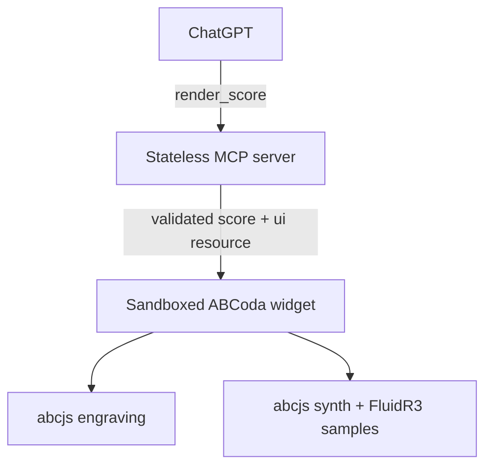

# ABCoda

Interactive ABC music notation inside AI conversations. ABCoda is a small TypeScript MCP App: the model calls `render_score`, the server validates the payload and supplies a sandboxed single-file widget, and the browser does the rendering and audio work with abcjs.

## MVP capabilities

- responsive multi-voice notation from ABC;
- combined play/pause, return-to-beginning, loop, and live tempo control;
- General MIDI instrument selection and mute per ABC voice;
- playback cursor synchronized with the engraved score;
- click-to-seek by measure with a continuously moving playback cursor;
- ChatGPT host tokens, light/dark theme changes, and mobile layout;
- stateless MCP server: no auth, database, user data, or music backend.

## Architecture



The built widget is a self-contained HTML file. The only runtime network dependency is the default abcjs FluidR3_GM sample host, explicitly declared in the resource CSP.

## Tool contract

```ts
render_score({
  schemaVersion: 1,
  abc: "X:1\\nT:Duet\\n...",
  playback: {
    tempo: 72,
    instruments: { RH: "acoustic_grand_piano", LH: "cello" },
    mutedVoices: [],
    loop: false
  },
  display: {
    title: "Short duet",
    coloredVoices: true,
    preferredMeasuresPerLine: 4
  }
})
```

Voice keys must match ABC `V:` identifiers. The authoritative schemas and instrument allowlist live in [`shared/score.ts`](shared/score.ts).

## Local development

Requirements: Node.js 20 or newer.

```bash
npm install
npm run check
npm run dev
```

The MCP endpoint is `http://localhost:8787/mcp`; health is available at `/health`. Open `dist/widget/index.html?demo=1` to inspect the standalone demo. For ChatGPT, expose the MCP endpoint through an HTTPS tunnel and add that URL in Developer Mode.

## Deployment

### Cloudflare Workers (recommended)

ABCoda includes a native stateless Worker entrypoint. The widget remains a single HTML asset embedded in the Worker bundle; no KV, D1, R2, secrets, environment variables, or paid service is required.

In **Workers & Pages → Create application → Import a repository**, authorize GitHub and select `R3Neer/abcoda`. Use:

- Production branch: `main`
- Root directory: `/`
- Build command: `npm run build:widget`
- Deploy command: `npx wrangler deploy`

After deployment, health is at `https://<worker>.workers.dev/health` and the ChatGPT MCP endpoint is `https://<worker>.workers.dev/mcp`.

For a local Worker preview:

```bash
npm run dev:worker
```

### Container alternative

The included Dockerfile is intentionally platform-neutral:

```bash
docker build -t abcoda .
docker run --rm -p 8787:8787 abcoda
```

Deploy that image to any HTTPS container host (Railway, Render, Fly.io, or equivalent). No volumes or environment variables are required; `PORT` is optional.

## Security and privacy

- Input is Zod-validated and limited to 64 KiB.
- The server is stateless and writes nothing.
- Tool annotations declare the operation read-only and closed-world.
- The widget resource declares only the SoundFont host in `connectDomains` and `resourceDomains`.
- ABC is rendered through abcjs APIs rather than inserted as HTML.
- The single-file widget avoids third-party script/CDN dependencies.

For public deployment, add rate and request-body limits at the hosting edge. Authentication is intentionally absent from the MVP because the tool accesses no private data or privileged action.

## Licensing

ABCoda is MIT licensed. abcjs is MIT licensed. The default FluidR3_GM samples are loaded remotely and identified upstream as CC BY 3.0; see [`THIRD_PARTY_NOTICES.md`](THIRD_PARTY_NOTICES.md). The sample attribution must remain visible in any public distribution.

## Next milestones

1. Reintroduce measure-range selection only after reliable desktop and touch hit-testing is available.
2. Solo/volume per voice and transposition.
3. Export ABC/MIDI, then opt-in MusicXML/PDF conversion.
4. Self-hosted subsetted samples and better piano articulation.
5. Typed edit operations returned to the model.
