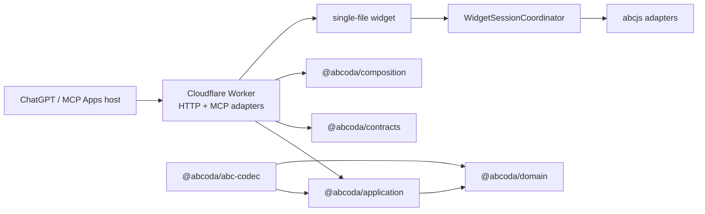

# ABCoda

ABCoda is a TypeScript MCP App for interactive ABC music notation inside AI conversations. It validates and presents structured score data through MCP, serves a sandboxed single-file widget, and delegates engraving/audio to abcjs in the browser.

The current architecture is canonical on `main`. The legacy schema-v1 runtime has been removed from the working tree; its history remains available through Git rather than as dormant production code.

## Current capabilities

- typed composition guidance through `prepare_composition`;
- structural ABC validation through `validate_score`;
- `render_score` presentation from a validated schema-v2 score snapshot;
- responsive multivoice engraving;
- play/pause, rewind, loop, live tempo and click-to-seek;
- revisioned local ABC editing, copy, apply/restore and history;
- global and per-voice semitone transposition of canonical ABC;
- General MIDI instrument selection and mute per voice;
- musicological instrument-range policy;
- technical SoundFont capability kept separate from musical range policy;
- pitched/percussion compatibility and percussion immunity to tonal transposition;
- synchronized playback cursor and responsive reflow;
- light/dark host themes, safe areas, forced-colors support and mobile layout;
- stateless Cloudflare Worker with bounded requests, Origin/Host validation and request correlation.

## Architecture



## Source layout

```text
apps/
  worker/       Cloudflare HTTP/MCP/resource adapter
  widget/       session/controllers + DOM/host/abcjs adapters

packages/
  domain/       pure musical model and policies
  application/  use cases and ports
  abc-codec/    source-preserving ABC parser/validator/operations
  contracts/    public schema-v2 transport contracts and build manifest
  composition/  composition/review guidance
```

There is no parallel schema-v1 server or widget in the working tree. Rollback to historical implementations, if ever needed for investigation, is done from Git history rather than by maintaining a second deployable stack.

## MCP tool surface

ABCoda exposes exactly three MCP tools:

- `prepare_composition`: data-only composition/review guidance;
- `validate_score`: validates one complete ABC tune and returns a revisioned schema-v2 score snapshot or diagnostics;
- `render_score`: presents a schema-v2 snapshot returned by `validate_score` and attaches the interactive MCP Apps UI resource.

The public schemas live in [`packages/contracts`](packages/contracts). `render_score` does not accept the retired schema-v1 `abc/composition/playback/notation/display` request shape.

## Local development

Requirements: Node.js 20 or newer.

```bash
npm install
npm run check
npm run test:browser
```

Useful commands:

```bash
npm run dev:widget
npm run build:worker
npm run test:worker
npm run verify:artifacts
```

## Deployment

The production Cloudflare Worker is configured only by [`apps/worker/wrangler.jsonc`](apps/worker/wrangler.jsonc), whose Worker name is `abcoda`.

Build and verify locally before an explicit deploy:

```bash
npm run check
npm run deploy:worker
npm run verify:deployment -- https://abcoda.mud-repo-patcher-mcp-probe.workers.dev
```

The deployment verifier probes the Worker over HTTPS and verifies health, MCP initialization, a stable tool list, schema-v2 `render_score`, tool calls, widget publication metadata, CORS/CSP and request correlation.

The manual GitHub Action **Deploy ABCoda** performs the same build, artifact verification, Cloudflare deployment and public verification using repository secrets. The production MCP contract must remain stable as:

```text
prepare_composition
validate_score
render_score
```

## Security and privacy

- Worker requests are method/content-type/body bounded before MCP processing.
- Origin/Host policy is validated and CORS reflects only allowed origins.
- Worker/MCP execution is request-scoped and stateless.
- Request IDs correlate HTTP and tool results.
- Structured observability does not copy ABC or prompts by default.
- ABC is rendered through abcjs APIs rather than inserted as HTML.
- The widget is built as a self-contained HTML asset.
- The MCP Apps resource CSP limits network access to the required sample origin.

## Quality gates

A normal CI run includes typed ESLint, TypeScript checks, unit/property/regression tests, widget + Worker builds, workerd integration tests, artifact/bundle checks, Playwright smoke and full browser suites, and visual-review artifact upload.

The test corpus under `tests/fixtures` belongs to the canonical parser/evaluator and is not a compatibility layer for schema v1.

Historical design and migration documents remain under `docs/architecture` and `docs/migration` as project records; they should not be read as alternate deployable implementations.

## Licensing

ABCoda is MIT licensed. abcjs is MIT licensed. The default FluidR3_GM samples are loaded remotely and identified upstream as CC BY 3.0; see [`THIRD_PARTY_NOTICES.md`](THIRD_PARTY_NOTICES.md). The sample attribution must remain visible in public distribution.
