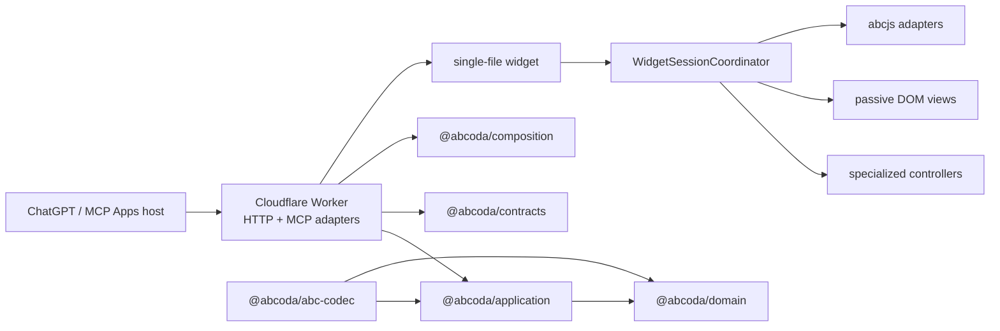

# ABCoda

ABCoda is a TypeScript MCP App for interactive ABC music notation inside AI conversations. It validates and presents structured score data through MCP, serves a sandboxed single-file widget, and delegates engraving/audio to abcjs in the browser.

`architecture-v2` is no longer a speculative rewrite. The core architecture, codec, Worker, widget session model, editing, playback, transposition and instrument-range policies are implemented and continuously tested. The remaining migration gates are a real public preview plus final human host/audio review.

## Current capabilities

- typed composition guidance through `prepare_composition`;
- structural ABC validation through `validate_score`;
- `render_score` with useful structured data plus an MCP Apps UI resource;
- responsive multivoice engraving;
- play/pause, rewind, loop, live tempo and click-to-seek;
- revisioned local ABC editing, copy, apply/restore and history;
- global and per-voice semitone transposition of canonical ABC;
- General MIDI instrument selection and mute per voice;
- musicological instrument-range policy:
  - normal `usual` notes;
  - orange `extended` notes that remain audible;
  - red `unplayable` notes that remain in notation/timeline but are silent;
  - `unbounded` presets where ABCoda deliberately does not invent a physical hard range;
- technical SoundFont capability kept separate from musical range policy;
- pitched/percussion compatibility and percussion immunity to tonal transposition;
- synchronized playback cursor and responsive reflow;
- light/dark host themes, safe areas, forced-colors support and mobile layout;
- stateless Cloudflare Worker with bounded requests, Origin/Host validation and request correlation.

## Architecture



The important boundaries are enforced by tests, not merely by directory names:

- workspaces consume public `@abcoda/*` APIs instead of another package's `src` internals;
- domain/application do not depend on MCP, Cloudflare, DOM or abcjs;
- internal revisioned score state is separate from versioned transport DTOs;
- `main.ts` is a composition root while `WidgetSessionCoordinator` owns cross-controller coordination;
- editor, mixer, transport and shell are separate DOM views;
- abcjs is browser-side only;
- musical range, synth sample capability and visual severity are independent policies.

The normative design and migration closeout plan live in:

- [`docs/architecture/ABCoda-arquitectura-objetivo.md`](docs/architecture/ABCoda-arquitectura-objetivo.md)
- [`docs/architecture/ABCoda-plan-implementacion-y-migracion.md`](docs/architecture/ABCoda-plan-implementacion-y-migracion.md)
- [`docs/migration/STATUS.md`](docs/migration/STATUS.md)
- [`docs/migration/CAPABILITIES.md`](docs/migration/CAPABILITIES.md)

## Source layout

```text
apps/
  worker/       Cloudflare HTTP/MCP/resource adapter
  widget/       session/controllers + DOM/host/abcjs adapters

packages/
  domain/       pure musical model and policies
  application/  use cases and ports
  abc-codec/    source-preserving ABC parser/validator/operations
  contracts/    versioned public schemas and build manifest
  composition/  composition/review guidance
```

`packages/composition` is internally modularized rather than storing its catalog and planner in one giant barrel. `packages/abc-codec` deliberately grows from real fixtures instead of pretending to implement the entire ABC ecosystem in advance.

## Tool surface

ABCoda currently exposes three MCP tools:

- `prepare_composition`: data-only composition/review guidance;
- `validate_score`: data-only structural score validation;
- `render_score`: canonical score/presentation result plus the UI resource.

The public schemas live in [`packages/contracts`](packages/contracts). The internal application model is intentionally not the same type as its public versioned DTO.

## Instrument ranges and audio

Instrument policy operates in sounding MIDI pitch. For concrete pitched instruments, the domain distinguishes `usualRange` and `playableRange`; percussion has its own policy; generic presets such as choir/organ/ensemble are not assigned invented organological hard limits.

That is separate from what the current synth backend can technically load. The abcjs adapter characterizes the current abcjs 6.7.0 + FluidR3_GM integration:

- melodic samples: MIDI 21–108;
- percussion samples: MIDI 28–87.

A pitch outside technical sample coverage is neutralized before sample loading without altering the ABC or deleting its timing event. Updating abcjs intentionally trips a regression until that backend assumption is re-characterized.

## Local development

Requirements: Node.js 20 or newer.

```bash
npm install
npm run check
npm run test:browser
```

Useful v2 commands:

```bash
npm run dev:v2-widget
npm run build:v2-worker
npm run test:v2-worker
npm run verify:v2-artifacts
```

The standalone widget scenarios are used by Playwright as a deterministic UI laboratory. Browser CI covers desktop/mobile, themes, range states, reflow, cursor, keyboard/accessibility behavior and produces visual-review artifacts.

## Preview deployment

The v2 preview Worker is configured separately as `abcoda-v2-preview` in [`apps/worker/wrangler.jsonc`](apps/worker/wrangler.jsonc).

Build/test the artifacts first, then deploy explicitly:

```bash
npm run check
npm run deploy:v2-preview
npm run verify:v2-preview -- https://<preview>.workers.dev
```

`verify:v2-preview` is a real HTTPS probe. It compares the remote artifact hash with the locally tested widget and checks `/health`, MCP initialization, tool discovery/calls, UI resource, CORS, CSP and request-ID correlation.

A manual GitHub Action, **Deploy v2 preview**, performs the same sequence when `CLOUDFLARE_API_TOKEN` and `CLOUDFLARE_ACCOUNT_ID` are configured as repository secrets. It intentionally does not deploy on every branch push.

The legacy `deploy:worker` command remains separate; do not confuse it with the v2 preview command while migration is still open. Humanity has suffered enough from scripts whose names are almost the same.

## Security and privacy

- Worker requests are method/content-type/body bounded before MCP processing.
- Origin/Host policy is validated and CORS reflects only allowed origins.
- Worker/MCP execution is request-scoped and stateless.
- Request IDs correlate HTTP and tool results.
- Structured observability does not copy ABC or prompts by default.
- ABC is rendered through abcjs APIs rather than inserted as HTML.
- The widget is built as a self-contained HTML asset.
- The MCP Apps resource CSP limits network access to the required sample origin.

## Quality gates

A normal CI run includes:

- typed ESLint;
- TypeScript checks;
- unit/property/regression tests;
- widget + Worker builds;
- workerd integration tests;
- artifact/bundle checks;
- Playwright smoke and full browser suites;
- visual-review artifact upload.

Architecture-specific regressions additionally guard package boundaries, cycles, DOM-view cohesion, protocol/domain separation, source-preserving transformations, request privacy and synth capability assumptions.

## Migration status

The structural refactor is complete. The remaining candidate gates are:

1. authenticated deployment of the real v2 preview and a green `v2-preview-validation.json`;
2. final human validation in an MCP Apps host, including audible playback/instrument/range behavior and manual accessibility review;
3. final CAP/FIX classification and candidate/rollback procedure.

See [`docs/migration/STATUS.md`](docs/migration/STATUS.md) for the current authoritative state.

## Licensing

ABCoda is MIT licensed. abcjs is MIT licensed. The default FluidR3_GM samples are loaded remotely and identified upstream as CC BY 3.0; see [`THIRD_PARTY_NOTICES.md`](THIRD_PARTY_NOTICES.md). The sample attribution must remain visible in public distribution.