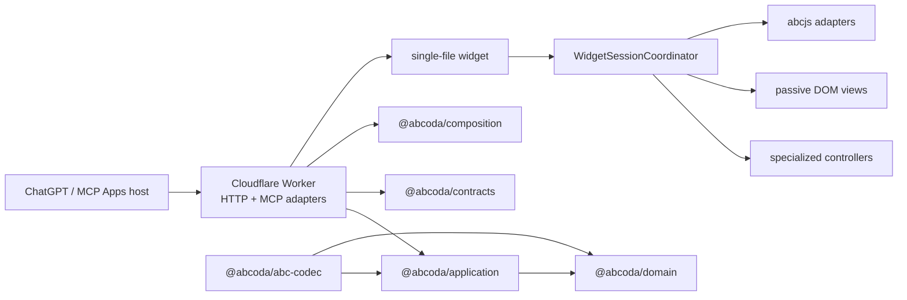

# ABCoda

ABCoda is a TypeScript MCP App for interactive ABC music notation inside AI conversations. It validates and presents structured score data through MCP, serves a sandboxed single-file widget, and delegates engraving/audio to abcjs in the browser.

The architecture previously developed on `architecture-v2` is now the canonical implementation on `main`. The legacy schema-v1 runtime has been removed from the working tree; its history remains available through Git rather than as dormant production code.

## Current capabilities

- typed composition guidance through `prepare_composition`;
- structural ABC validation through `validate_score`;
- `render_score` presentation from a validated schema-v2 score snapshot;
- responsive multivoice engraving;
- play/pause, rewind, loop, live tempo and click-to-seek;
- revisioned local ABC editing, copy, apply/restore and history;
- global and per-voice semitone transposition of canonical ABC;
- General MIDI instrument selection and mute per voice;
- musicological instrument-range policy:
  - normal `usual` notes;
  - orange `extended` notes that remain audible;
  - red `unplayable` notes that remain in notation/timeline but are silent;
  - `unbounded` presets where ABCoda deliberately does not invent a physical hard range;
- technical SoundFont capability kept separate from musical range policy;
- pitched/percussion compatibility and percussion immunity to tonal transposition;
- synchronized playback cursor and responsive reflow;
- light/dark host themes, safe areas, forced-colors support and mobile layout;
- stateless Cloudflare Worker with bounded requests, Origin/Host validation and request correlation.

## Architecture



The important boundaries are enforced by tests, not merely by directory names:

- workspaces consume public `@abcoda/*` APIs instead of another package's `src` internals;
- domain/application do not depend on MCP, Cloudflare, DOM or abcjs;
- internal revisioned score state is separate from versioned transport DTOs;
- `main.ts` is a composition root while `WidgetSessionCoordinator` owns cross-controller coordination;
- editor, mixer, transport and shell are separate DOM views;
- abcjs is browser-side only;
- musical range, synth sample capability and visual severity are independent policies.

## Source layout

```text
apps/
  worker/       Cloudflare HTTP/MCP/resource adapter
  widget/       session/controllers + DOM/host/abcjs adapters

packages/
  domain/       pure musical model and policies
  application/  use cases and ports
  abc-codec/    source-preserving ABC parser/validator/operations
  contracts/    public schema-v2 transport contracts and build manifest
  composition/  composition/review guidance
```

There is no parallel schema-v1 server or widget in the working tree. Rollback to historical implementations, if ever needed for investigation, is done from Git history rather than by maintaining a second deployable stack.

## MCP tool surface

ABCoda exposes exactly three MCP tools:

- `prepare_composition`: data-only composition/review guidance;
- `validate_score`: validates one complete ABC tune and returns a revisioned schema-v2 score snapshot or diagnostics;
- `render_score`: presents a schema-v2 snapshot returned by `validate_score` and attaches the interactive MCP Apps UI resource.

The public schemas live in [`packages/contracts`](packages/contracts). `render_score` does not accept the retired schema-v1 `abc/composition/playback/notation/display` request shape.

## Instrument ranges and audio

Instrument policy operates in sounding MIDI pitch. For concrete pitched instruments, the domain distinguishes `usualRange` and `playableRange`; percussion has its own policy; generic presets such as choir/organ/ensemble are not assigned invented organological hard limits.

That is separate from what the current synth backend can technically load. A pitch outside technical sample coverage is neutralized before sample loading without altering the ABC or deleting its timing event. Backend assumptions are characterized by regression tests so dependency updates cannot silently change them.

## Local development

Requirements: Node.js 20 or newer.

```bash
npm install
npm run check
npm run test:browser
```

Useful implementation-specific commands retained from the v2 migration naming:

```bash
npm run dev:v2-widget
npm run build:v2-worker
npm run test:v2-worker
npm run verify:v2-artifacts
```

The `v2` labels in these command names are historical naming only. They all address the canonical implementation on `main`.

## Deployment

The production Cloudflare Worker is configured only by [`apps/worker/wrangler.jsonc`](apps/worker/wrangler.jsonc), whose Worker name is `abcoda`.

Build and verify locally before an explicit deploy:

```bash
npm run check
npm run deploy:worker
npm run verify:v2-preview -- https://abcoda.mud-repo-patcher-mcp-probe.workers.dev
```

The verification script retains its historical `v2-preview` name, but it probes the deployed Worker over HTTPS and verifies health, MCP initialization, a stable tool list, schema-v2 `render_score`, tool calls, UI resource, CORS/CSP and request correlation.

The manual GitHub Action **Deploy ABCoda** performs the same build, artifact verification, Cloudflare deployment and public verification using repository secrets. The production MCP contract must remain stable as:

```text
prepare_composition
validate_score
render_score
```

## Security and privacy

- Worker requests are method/content-type/body bounded before MCP processing.
- Origin/Host policy is validated and CORS reflects only allowed origins.
- Worker/MCP execution is request-scoped and stateless.
- Request IDs correlate HTTP and tool results.
- Structured observability does not copy ABC or prompts by default.
- ABC is rendered through abcjs APIs rather than inserted as HTML.
- The widget is built as a self-contained HTML asset.
- The MCP Apps resource CSP limits network access to the required sample origin.

## Quality gates

A normal CI run includes:

- typed ESLint;
- TypeScript checks;
- unit/property/regression tests;
- widget + Worker builds;
- workerd integration tests;
- artifact/bundle checks;
- Playwright smoke and full browser suites;
- visual-review artifact upload.

The test corpus that remains under `tests/fixtures` belongs to the canonical parser/evaluator and is not a compatibility layer for schema v1.

## Migration status

The architecture migration is complete:

1. the former v2 implementation is canonical on `main`;
2. production uses the canonical Cloudflare Worker and schema-v2 MCP surface;
3. the `architecture-v2` branch has been retired;
4. the schema-v1 runtime, deploy path, contracts and implementation-specific tests have been removed from the working tree;
5. rollback/history remains available through Git commits rather than dormant source code.

Historical design and migration documents remain under `docs/architecture` and `docs/migration` as project records; they should not be read as alternate deployable implementations.

## Licensing

ABCoda is MIT licensed. abcjs is MIT licensed. The default FluidR3_GM samples are loaded remotely and identified upstream as CC BY 3.0; see [`THIRD_PARTY_NOTICES.md`](THIRD_PARTY_NOTICES.md). The sample attribution must remain visible in public distribution.
