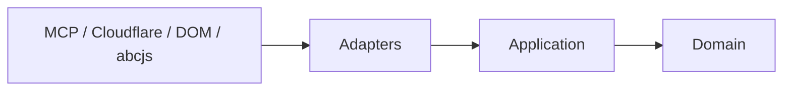
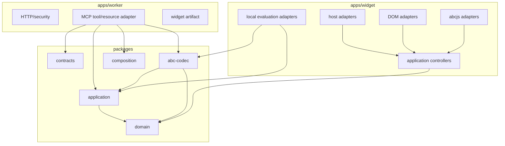
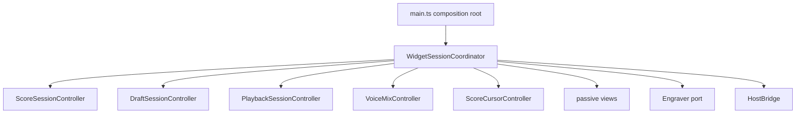

# ABCoda: arquitectura vigente

> Estado: arquitectura normativa y auditoría de la implementación real  
> Rama de trabajo: `architecture-v2`  
> Base auditada: `540890c718f7f20c320cb4f8566f214fbd75e9c8`  
> Plan asociado: [plan de implementación y migración](./ABCoda-plan-implementacion-y-migracion.md)

## 1. Propósito

Este documento sustituye la antigua “arquitectura objetivo” redactada antes de empezar la reconstrucción. Ya no describe un sistema hipotético: describe la arquitectura que ABCoda **debe mantener**, qué partes están materializadas en el repositorio y qué desviaciones reales deben corregirse antes de considerar `architecture-v2` candidata a sustituir `main`.

La regla principal sigue siendo la misma: ABCoda debe ser un sistema pequeño, modular y comprobable en el que el dominio musical no dependa de MCP, Cloudflare, el DOM ni `abcjs`.

## 2. Veredicto de la auditoría

La arquitectura actual **no es una mala arquitectura que deba tirarse y rehacerse**. El núcleo nuevo está bien encaminado y conserva las decisiones correctas del plan original:

- dominio musical separado en `packages/domain`;
- codec ABC propio y source-preserving en `packages/abc-codec`;
- casos de uso y puertos en `packages/application`;
- contratos externos versionados en `packages/contracts`;
- conocimiento de composición aislado en `packages/composition`;
- Worker y MCP como adaptadores en `apps/worker`;
- widget con controladores de aplicación y adaptadores de host, DOM y abcjs;
- Worker stateless y sin `abcjs`;
- pruebas unitarias, workerd y Playwright dentro de CI;
- laboratorio standalone para revisar UI y screenshots;
- política de tesituras musical separada de la capacidad técnica del SoundFont.

Sin embargo, la implementación ha acumulado deuda en cuatro puntos que conviene resolver **antes de seguir añadiendo grandes superficies funcionales**.

| ID | Deuda | Gravedad | Decisión |
|---|---|---:|---|
| ARCH-01 | Los workspaces existen, pero muchos consumidores importan directamente `packages/*/src/...` en vez de usar `@abcoda/*`. | alta | Convertir las fronteras lógicas en fronteras reales de paquete y declarar dependencias workspace. |
| ARCH-02 | `apps/widget/src/main.ts` sigue poseyendo estado cruzado de sesión en variables de módulo y coordina demasiados subsistemas. | alta | Mantener los controladores existentes, pero introducir un `WidgetSessionCoordinator` y dejar `main.ts` como composition root casi declarativo. |
| ARCH-03 | `DomWidgetView` supera ampliamente el tamaño razonable de una vista única y concentra editor, mixer, transporte y shell. | media-alta | Separar vistas/componentes por responsabilidad sin mover lógica musical al DOM. |
| ARCH-04 | `ScoreSnapshot` vive en `domain` e incluye `schemaVersion`, aunque el plan separaba entidad de dominio y DTO externo. | media | Separar la proyección interna revisionada del DTO versionado de `packages/contracts`. |
| ARCH-05 | `packages/composition/src/index.ts` concentra una gran cantidad de catálogo y ensamblado. | media | Dividir internamente por catálogos, políticas, ensamblado e instrucciones antes de que siga creciendo. |
| ARCH-06 | El codec realiza transformaciones sobre eventos parseados, pero todavía reescribe lexemas y vuelve a parsear el fuente. | media | Mantenerlo como estrategia válida para el corpus actual, pero no extender regex globales como sustituto de semántica estructurada. |
| ARCH-07 | Observabilidad y envelopes de request siguen más simples que el diseño original. | baja-media | Completar solo lo necesario para preview/candidato; no sobrearquitectar telemetría antes de tener necesidad operativa. |

La conclusión es, por tanto, **conservar la arquitectura y hacer una refactorización dirigida**, no reiniciar la reconstrucción.

## 3. Principios normativos

### P-01. Dominio puro

`packages/domain` contiene reglas, invariantes, tipos y políticas musicales. No importa:

- MCP o MCP Apps;
- Cloudflare o Node;
- DOM, Web Audio o APIs de navegador;
- `abcjs`;
- Zod o contratos externos.

### P-02. Dependencias hacia dentro

La dirección conceptual es:



Los adaptadores pueden depender de aplicación y dominio. El dominio no puede conocer adaptadores ni protocolos externos.

### P-03. Fronteras de paquete reales

Los workspaces no son simples carpetas decorativas. El objetivo es que el código entre paquetes consuma sus exports públicos:

```ts
import { EvaluateScore } from "@abcoda/application";
import { CanonicalAbcCodec } from "@abcoda/abc-codec";
import { instrumentDefinition } from "@abcoda/domain";
```

No debe convertirse en práctica normal:

```ts
import { EvaluateScore } from "../../../../packages/application/src/index";
```

Cada workspace declara sus dependencias `workspace:*`. CI y ESLint deben poder detectar una dependencia prohibida sin depender de contar niveles de `../`.

### P-04. Documento canónico source-preserving

ABCoda no necesita fingir que implementa toda la especificación ABC como un AST semántico perfecto. El modelo vigente es una representación canónica **estructurada y conservadora**:

- headers y directivas conocidas;
- voces;
- compases;
- eventos con `SourceRange`;
- duración cuando puede conocerse;
- lexema original;
- nodos opacos seguros para sintaxis no comprendida.

Esto es mejor que editar el fichero mediante regex globales y permite round-trip sin destruir construcciones desconocidas.

Una transformación puede usar un parser local de lexema para una nota, acorde o armadura concreta, pero siempre debe partir de eventos identificados por el documento parseado y sus rangos de origen. No se debe volver a una arquitectura en la que buscar y reemplazar texto sea el modelo musical.

### P-05. Estado con propietario

Cada estado mutable debe tener un propietario único. No se exige un reducer global si controladores pequeños expresan mejor el problema.

La arquitectura vigente adopta explícitamente **controladores especializados + coordinador de sesión** en lugar del reducer monolítico propuesto originalmente.

Propiedad objetivo:

| Estado | Propietario |
|---|---|
| snapshot y ciclo de grabado | `ScoreSessionController` |
| borrador, historial y revisión local | `DraftSessionController` |
| reproducción y tempo efectivo | `PlaybackSessionController` |
| instrumento/mute por voz | `VoiceMixController` |
| posición visual y seek | `ScoreCursorController` |
| estado cruzado entre subsistemas | `WidgetSessionCoordinator` |
| DOM | vistas/adaptadores DOM |
| contexto de host | `HostBridge` / runtime |

`main.ts` debe crear estos objetos, conectarlos y gestionar teardown. No debe convertirse en un segundo store mediante variables de módulo.

### P-06. Concurrencia explícita

Las operaciones asíncronas se asocian a una revisión o a una generación de efecto. Un resultado obsoleto nunca puede publicar sobre uno nuevo.

La cancelación puede implementarse con `AbortSignal`, tokens/generaciones o invalidación explícita según el adaptador. Lo normativo es el comportamiento, no una API concreta.

### P-07. UI opcional, datos útiles sin UI

`prepare_composition` y `validate_score` son herramientas de datos. `render_score` asocia el recurso UI, pero su `structuredContent` sigue siendo útil si el host ignora el widget.

### P-08. Tecnología en los bordes

- `abcjs` pertenece al navegador y a sus adaptadores.
- MCP SDK pertenece al adaptador MCP.
- Cloudflare pertenece al Worker.
- Zod pertenece a contratos/bordes.
- las políticas musicales no se duplican en DOM o audio.

## 4. Topología actual



Esta topología es correcta. La deuda ARCH-01 no cuestiona la dirección, sino que actualmente TypeScript expresa varias de estas flechas mediante rutas internas de fichero en vez de imports de paquete.

## 5. Núcleo musical

### 5.1 `ScoreDocument`

`ScoreDocument` es el agregado rico utilizado por codec, validación y operaciones. Debe continuar siendo inmutable desde la perspectiva de los casos de uso.

Las voces y eventos usan identificadores estables dentro de una revisión y conservan referencias a fuente.

### 5.2 Snapshot interno frente a DTO externo

La implementación actual contiene `schemaVersion: 2` dentro del `ScoreSnapshot` de dominio. Esto funciona, pero mezcla dos conceptos:

1. una proyección revisionada que la aplicación necesita;
2. un formato público versionado que MCP/widget intercambian.

Objetivo de refactor:

```text
Domain/Application
  RevisionedScore / ScoreProjection
        ↓ adapter
Contracts
  ScoreSnapshotDto(schemaVersion)
```

El dominio puede conocer `RevisionId`, pero no debería necesitar saber que el protocolo externo está en schema 2.

### 5.3 Operaciones

Las operaciones tipadas vigentes incluyen transposición global y por voz, instrumento, mute y restauración. Percusión permanece fuera de la transposición tonal.

La implementación de transposición usa eventos parseados y source ranges para reescribir únicamente lexemas afectados y después vuelve a parsear. Es aceptable mientras:

- pase round-trip y propiedades;
- no toque nodos opacos;
- no cree regex globales que decidan estructura musical;
- amplíe soporte solo a partir de fixtures reales.

Si las operaciones empiezan a necesitar ligaduras complejas, múltiples capas de accidentalidad o semántica que no pueda expresarse de forma local, deberá enriquecerse el modelo antes de añadir más parches de texto.

## 6. Conocimiento de composición

`packages/composition` es deliberadamente distinto del dominio de partitura. Contiene conocimiento editorial/estilístico usado para preparar instrucciones de composición.

La separación es buena, pero el módulo principal ya es suficientemente grande para justificar una división interna:

```text
packages/composition/src/
  catalogs/
  policies/
  planner/
  review/
  instructions/
  index.ts
```

No es necesario crear paquetes nuevos. El objetivo es que una modificación de, por ejemplo, reglas de revisión no obligue a navegar un único fichero masivo.

## 7. Worker y MCP

El Worker actual respeta la arquitectura deseada:

- frontera HTTP antes del transporte MCP;
- allowlist de Origin/Host;
- límites de body;
- headers defensivos;
- request ID y logs estructurados;
- servidor MCP creado por petición;
- `prepare_composition`, `validate_score` y `render_score` como superficies diferenciadas;
- recurso widget servido como artefacto;
- no se importa `abcjs` en servidor.

`create-server.ts` puede dividirse por herramienta y compatibilidad legacy cuando el fichero siga creciendo, pero no contiene una violación de dominio que justifique una reescritura inmediata.

El Worker debe permanecer stateless hasta que exista un requisito real de persistencia.

## 8. Widget

### 8.1 Decisión revisada

El diseño previo pedía “reducer + effect supervisor”. La implementación ha demostrado que varios controladores pequeños son más naturales para este producto. Esa desviación se acepta como mejora de diseño.

Lo que **no** se acepta es dejar estado de sesión relacionado repartido indefinidamente en variables de `main.ts`.

### 8.2 Objetivo inmediato



El coordinador no debe convertirse en una god class. Su trabajo es poseer exclusivamente la coordinación que hoy queda dispersa: presentación del host, análisis de pitches, identidad de revisión del cursor, estado de layout/reflow y orden de reconstrucción de subsistemas.

### 8.3 Vistas DOM

`DomWidgetView` debe partirse antes de introducir grandes controles nuevos. División orientativa:

```text
adapters/dom/
  widget-shell-view.ts
  score-view.ts
  transport-view.ts
  mixer-view.ts
  editor-view.ts
  range-presentation.ts
  score-cursor-view.ts
```

Estas vistas siguen siendo pasivas: reciben estado y emiten acciones. No clasifican tesituras, no deciden compatibilidad instrumental y no gestionan reproducción.

## 9. Grabado, audio y tesituras

Hay tres conceptos distintos y no deben fusionarse:

1. **política musical de tesitura**, propiedad del dominio;
2. **capacidad técnica de síntesis**, propiedad del adaptador/backend de audio;
3. **presentación visual**, propiedad del widget.

Para instrumentos `bounded`, el dominio clasifica `usual`, `extended` y `unplayable` usando pitch sonante.

Para presets `unbounded`, ABCoda no afirma una frontera organológica que no pueda justificar. Eso no implica que el SoundFont soporte cualquier pitch.

El adaptador de audio debe garantizar que nunca solicita al backend una muestra técnicamente imposible. Esta protección no puede deducirse de `playableRange` y debe probarse por separado.

Las notas musicalmente `unplayable` permanecen en notación y timeline, pero son silenciosas en playback. No se eliminan eventos para conseguir silencio.

## 10. Seguridad y privacidad

Normas vigentes:

- validar Origin y Host en la frontera HTTP;
- limitar método, content type y body antes de parsear;
- responder CORS únicamente para orígenes permitidos;
- no guardar ABC ni prompts en logs por defecto;
- no introducir secretos en el widget;
- CSP de mínima autoridad;
- no insertar ABC como HTML;
- mantener estado de petición fuera del ámbito global del Worker.

Rate limiting de plataforma puede añadirse en despliegue público, pero no sustituye los límites internos.

## 11. Estrategia de pruebas

| Nivel | Responsabilidad |
|---|---|
| dominio | invariantes, tesituras, operaciones y tipos puros |
| codec | parsing, round-trip, source ranges, validación y transformaciones |
| aplicación | casos de uso con puertos/fakes |
| contratos | schemas y compatibilidad legacy/v2 |
| Worker | HTTP, seguridad, MCP y runtime workerd |
| widget unitario | controladores, carreras y coordinadores |
| navegador | DOM, layout, foco, abcjs, reproducción e integración |
| visual | screenshots focalizados desktop/móvil y temas |
| manual | audición, lector de pantalla y calidad subjetiva de interacción |

Una captura no sustituye una aserción semántica y una aserción semántica no sustituye una revisión visual cuando el requisito es visual.

## 12. Versionado

Se mantienen separados:

- `appVersion`;
- `schemaVersion`;
- `rulesVersion`;
- `artifactHash`.

La fuente de verdad sigue en `packages/contracts`/manifiesto de build. La futura separación del snapshot interno no cambia esta regla: la versión pública pertenece al contrato, no al dominio.

## 13. Decisiones arquitectónicas vigentes

| ADR lógico | Decisión |
|---|---|
| A-001 | Monolito modular; no microservicios prematuros. |
| A-002 | Dominio puro y documento ABC canónico source-preserving. |
| A-003 | Herramientas de datos separadas de presentación. |
| A-004 | MCP Apps como base; extensiones de host aisladas. |
| A-005 | Controladores especializados + coordinador de sesión, no reducer global obligatorio. |
| A-006 | Worker stateless por defecto. |
| A-007 | Una melodía por snapshot en el MVP; tunebooks se rechazan explícitamente. |
| A-008 | `abcjs` únicamente como adaptador de navegador. |
| A-009 | Versiones y artefacto derivados de una fuente central. |
| A-010 | Workerd y navegador real forman parte de la evidencia de calidad. |
| A-011 | Tesitura musical y capacidad del sintetizador son políticas independientes. |
| A-012 | Sintaxis ABC desconocida se conserva de forma opaca o se rechaza explícitamente; nunca se borra en silencio. |

## 14. Criterios de aceptación arquitectónica

La arquitectura se considera suficientemente materializada para candidato cuando:

1. `domain` no importa infraestructura ni contratos externos;
2. los workspaces se consumen mediante sus APIs públicas, no mediante rutas a `src`;
3. el Widget no contiene reglas musicales en DOM/abcjs;
4. `main.ts` es un composition root y el estado cruzado tiene propietario explícito;
5. editor, mixer, transporte y shell no viven en una única vista gigante;
6. una revisión antigua no puede publicar sobre una nueva;
7. tunebooks múltiples reciben diagnóstico explícito;
8. Worker, contratos y widget usan una fuente de versión coherente;
9. Origin/Host/body/métodos están probados en workerd;
10. `abcjs` no forma parte del bundle server-side;
11. tests browser cubren los flujos críticos y generan evidencia visual focalizada;
12. fallos de audio no invalidan notación ni edición;
13. `ScoreSnapshotDto` y el modelo interno dejan de ser el mismo tipo por comodidad;
14. tesitura musical y cobertura de muestras siguen separadas;
15. toda desviación consciente respecto a esta arquitectura está documentada antes de extenderla.

## 15. Regla para el trabajo futuro

No se debe abrir otra reescritura general para “limpiar arquitectura”. Las deudas anteriores se corrigen en cortes pequeños con comportamiento preservado y CI verde.

Pero tampoco se debe seguir añadiendo funcionalidad ilimitadamente sobre `main.ts`, `DomWidgetView` o imports internos entre paquetes. Esos tres puntos son ahora **límites de crecimiento**, no tareas cosméticas opcionales.

La arquitectura buena de ABCoda ya existe en lo esencial. El trabajo pendiente consiste en hacer que sus fronteras sean tan reales en el código como lo son en los diagramas.
