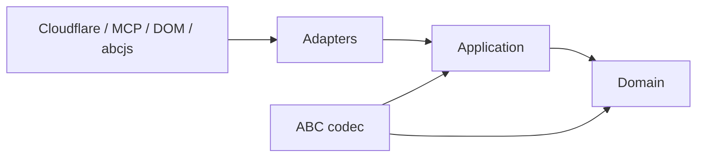
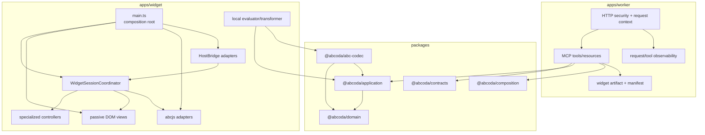
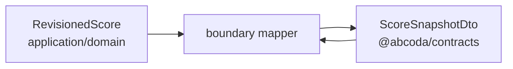
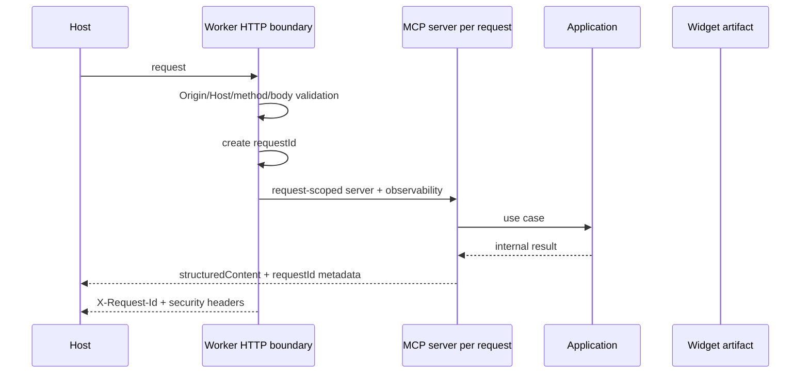

# ABCoda: arquitectura vigente

> Estado: arquitectura normativa materializada  
> Rama de trabajo: `architecture-v2`  
> Corte arquitectónico auditado: `2a40b50318a00ee6965cc4903a7b31c7a2339e5e`  
> Plan asociado: [plan de implementación y migración](./ABCoda-plan-implementacion-y-migracion.md)  
> Estado operativo: [migration/STATUS.md](../migration/STATUS.md)

## 1. Propósito

Este documento describe la arquitectura que ABCoda **tiene y debe preservar**. Ya no es una arquitectura hipotética ni una lista de refactors pendientes.

La auditoría iniciada sobre `540890c7` detectó siete desviaciones estructurales. ARCH-01…ARCH-07 se corrigieron individualmente mediante análisis, diseño temporal, pruebas de regresión, implementación, CI integral y auditoría posterior. Los documentos temporales se eliminaron al cerrar cada corte.

La conclusión después de esos refactors es más fuerte que la inicial: ABCoda no necesita otra reescritura general. Su arquitectura base es suficientemente limpia para evolucionar mediante cambios pequeños y verificables.

Lo que queda antes de candidato es principalmente **evidencia operacional y humana**, no reconstrucción estructural:

- M7: preview pública real de Worker/MCP Apps;
- M8: audición y revisión dentro del host real;
- clasificación final CAP/FIX y procedimiento de rollback.

## 2. Veredicto arquitectónico actual

Las deudas de la auditoría están cerradas:

| ID | Problema auditado | Estado materializado |
|---|---|---|
| ARCH-01 | Fronteras workspace lógicas pero atravesadas mediante imports a `packages/*/src`. | **closed**. Los consumidores usan APIs públicas `@abcoda/*`; manifiestos expresan dependencias internas y una regresión estructural detecta imports privados y ciclos. |
| ARCH-02 | Estado y coordinación transversal en `main.ts`. | **closed**. `WidgetSessionCoordinator` posee la coordinación cruzada; `main.ts` crea dependencias, enlaza acciones y teardown. |
| ARCH-03 | `DomWidgetView` como vista monolítica. | **closed**. La fachada delega en `WidgetShellView`, `TransportView`, `MixerView` y `EditorView`; cursor y presentación de rangos siguen siendo adaptadores específicos. |
| ARCH-04 | Snapshot interno mezclado con `schemaVersion` externo. | **closed**. Aplicación/dominio usan una proyección revisionada interna; `ScoreSnapshotDto` vive en contratos y los mappers de frontera están probados en round-trip. |
| ARCH-05 | `packages/composition/src/index.ts` concentraba catálogo, política y ensamblado. | **closed**. Schema, catálogos, política de performance, planner e instrucciones están separados; el barrel vuelve a ser pequeño. |
| ARCH-06 | Transformaciones source-preserving todavía podían recaer en reescaneos globales. | **closed** para el alcance actual. `ScoreField` y sus source ranges permiten transformar campos parseados; hay una regresión que prohíbe reintroducir el reescaneo global de tonalidades. |
| ARCH-07 | Observabilidad/correlación más pobre que el diseño inicial. | **closed** para candidato. Request ID correlaciona HTTP y resultados MCP, los eventos son estructurados y los logs no copian ABC/prompts; no se introdujo un envelope público innecesario. |

No hay actualmente una deuda arquitectónica conocida de severidad alta que justifique bloquear nuevas mejoras después de candidato.

## 3. Principios normativos

### P-01. Dominio puro

`packages/domain` contiene tipos, invariantes y políticas musicales. No conoce:

- MCP/MCP Apps;
- Cloudflare o Node;
- DOM/Web Audio;
- `abcjs`;
- Zod ni schemas de transporte.

Una modificación de protocolo, host o sintetizador no debe obligar a modificar el dominio salvo que cambie una regla musical real.

### P-02. Dependencias hacia dentro



Los adaptadores conocen las capas interiores; las capas interiores no conocen los adaptadores.

### P-03. Fronteras de paquete reales

Los workspaces se consumen mediante exports públicos:

```ts
import { EvaluateScore } from "@abcoda/application";
import { CanonicalAbcCodec } from "@abcoda/abc-codec";
import { instrumentDefinition } from "@abcoda/domain";
```

No se permite que otro workspace importe `packages/<x>/src/**` para saltarse la API. La forma exacta de declarar la dependencia local en npm no es normativa; sí lo es que el manifiesto exprese el grafo y que el consumidor use la frontera pública.

La prueba arquitectónica de workspaces es parte de la definición de terminado, no una comprobación ocasional.

### P-04. Documento ABC source-preserving

ABCoda no pretende implementar toda la especificación ABC como un AST universal. El modelo canónico es deliberadamente incremental y conservador:

- headers/directivas y campos conocidos;
- voces y eventos;
- compases;
- `SourceRange` y lexema original;
- campos ABC con rango de valor;
- nodos opacos cuando una construcción puede preservarse con seguridad.

Las transformaciones parten de elementos ya parseados y de sus rangos de fuente. Puede existir un parser local de lexema y puede reparsarse el documento al terminar una transformación. Lo prohibido es volver a usar búsqueda/reemplazo global como sustituto de estructura musical.

Cuando una transformación necesite semántica que el modelo no contiene, se enriquece el modelo antes de añadir heurísticas de texto cada vez más amplias.

### P-05. Estado mutable con propietario

El estado se reparte por responsabilidad:

| Estado | Propietario |
|---|---|
| snapshot y ciclo de grabado | `ScoreSessionController` |
| borrador, historial y revisión local | `DraftSessionController` |
| reproducción/tempo/loop | `PlaybackSessionController` |
| instrumento y mute por voz | `VoiceMixController` |
| cursor/seek visual | `ScoreCursorController` |
| coordinación entre subsistemas | `WidgetSessionCoordinator` |
| elementos/estado visual | vistas DOM |
| contexto del host | `HostBridge` / runtime |

ABCoda adopta controladores especializados + coordinador de sesión. No hay requisito de un reducer global.

### P-06. Concurrencia explícita

Cada trabajo asíncrono que pueda quedar obsoleto se liga a revisión, generación o cancelación. Un resultado viejo no puede publicar sobre una revisión nueva.

La API concreta puede ser `AbortSignal`, generación o invalidación explícita. El comportamiento es normativo; el patrón nominal no.

### P-07. Datos útiles sin UI

`prepare_composition` y `validate_score` son herramientas de datos. `render_score` aporta recurso UI, pero su `structuredContent` sigue siendo útil sin renderizado.

La UI es una capacidad adicional, no la única representación del resultado.

### P-08. Tecnología en los bordes

- `abcjs` pertenece al navegador/adaptador de grabado y audio;
- Cloudflare pertenece al Worker;
- MCP SDK pertenece al adaptador MCP;
- Zod pertenece a contratos/fronteras;
- políticas musicales no se duplican en DOM ni en audio.

## 4. Topología materializada



Las flechas entre workspaces pasan por sus APIs públicas. CI caracteriza esta topología para evitar que las fronteras vuelvan a ser puramente decorativas.

## 5. Núcleo musical y contratos

### 5.1 `ScoreDocument`

`ScoreDocument` es el agregado musical source-preserving. Es inmutable desde la perspectiva de los casos de uso y conserva identidad/rangos suficientes para validación y transformaciones.

### 5.2 Proyección revisionada interna

Dominio/aplicación trabajan con una proyección revisionada interna (`RevisionedScore` o equivalente), sin `schemaVersion` de transporte.



El mapper es explícito y tiene prueba directa de ida/vuelta. Un futuro schema 3 no debe cambiar el dominio solo porque cambie la representación pública.

### 5.3 Versiones

Se mantienen conceptos separados:

- `appVersion`;
- `schemaVersion`;
- `rulesVersion`;
- `artifactHash`.

Las versiones de protocolo pertenecen a contratos/manifest, no a entidades musicales.

## 6. Codec y operaciones

La estrategia vigente combina estructura canónica + preservación textual:

1. parsear y obtener documento/eventos/campos con ranges;
2. validar que la operación conoce la construcción que modifica;
3. producir replacements únicamente sobre rangos identificados;
4. preservar el resto del texto, incluidos nodos opacos;
5. reparsar y volver a validar el resultado.

La transposición global y por voz, tonalidades y acordes siguen este patrón. La percusión permanece fuera de transposición tonal.

No se exige eliminar el reparseo final. Es útil como comprobación de consistencia y evita mantener dos representaciones divergentes del mismo ABC.

## 7. Conocimiento de composición

`@abcoda/composition` es conocimiento editorial/estilístico, no dominio de partitura.

Su estructura actual separa responsabilidades internas, aproximadamente:

```text
packages/composition/src/
  catalogs/
  schema.ts
  performance-policy.ts
  planner.ts
  instructions.ts
  index.ts
```

`index.ts` es el contrato público, no el lugar donde acumular de nuevo todos los catálogos. Golden prompts y pruebas de composición protegen el comportamiento durante futuras ampliaciones.

## 8. Worker y MCP

El Worker es stateless por petición. El flujo relevante es:



Propiedades normativas:

- allowlist de Origin y comprobación Host;
- límites de método/content type/body antes de parsear;
- headers defensivos;
- servidor MCP creado por request;
- logs estructurados con campos allowlisted;
- no registrar ABC/prompts por defecto;
- `requestId` correlacionable entre HTTP y callbacks de herramienta;
- `abcjs` ausente del grafo/bundle server-side.

No se introduce persistencia hasta que exista un caso de uso real que la necesite.

## 9. Widget

### 9.1 Composition root

`apps/widget/src/main.ts` crea la vista, el coordinador, adapters de host/local/abcjs, conecta acciones DOM y gestiona `ResizeObserver`/teardown.

No posee ya el estado transversal de sesión.

### 9.2 Coordinador

`WidgetSessionCoordinator` posee únicamente la coordinación que cruza controladores: adopción de resultados, presentación, lifecycle de playback/mix/cursor y política de reflow. No debe absorber reglas musicales ni DOM específico.

La regla para su crecimiento es simple: si una responsabilidad puede pertenecer a un controlador o adaptador especializado, no pertenece al coordinador.

### 9.3 Vistas DOM

La UI está separada en piezas cohesionadas:

```text
adapters/dom/
  dom-widget-view.ts        # fachada
  widget-shell-view.ts
  transport-view.ts
  mixer-view.ts
  editor-view.ts
  dom-score-cursor.ts
  dom-range-presentation.ts
  dom-elements.ts
  dom-widget-actions.ts
```

Estas vistas reciben estado y emiten acciones. No clasifican tesituras, no deciden compatibilidad instrumental y no implementan política de reproducción.

## 10. Grabado, tesitura y audio

ABCoda mantiene **tres políticas independientes**:

1. política musical de tesitura;
2. capacidad técnica del backend de síntesis;
3. presentación visual de severidad.

### Tesitura musical

El dominio define:

- instrumentos `bounded` con `usualRange` y `playableRange`;
- presets `unbounded` cuando no existe una frontera organológica defendible;
- percusión con semántica propia.

Para `bounded`:

- `usual`: normal, audible;
- `extended`: visualmente advertida, audible;
- `unplayable`: visualmente crítica, silenciosa, pero permanece en notación/timeline.

### Capacidad técnica

El adaptador abcjs caracteriza la combinación soportada actualmente:

- abcjs 6.7.0;
- FluidR3_GM melódico MIDI 21–108;
- FluidR3_GM percusión MIDI 28–87.

Si una nota no tiene muestra, el adaptador neutraliza la petición antes del sample loading mediante pitch técnico seguro + volumen cero, sin alterar ABC ni eliminar el evento.

La versión de abcjs caracterizada está protegida por una regresión que obliga a recaracterizar al actualizarla.

### Presentación

La UI consume el estado musical y lo presenta en notas/selectores. Forced-colors y descripciones accesibles evitan depender únicamente del color.

## 11. Seguridad y privacidad

Normas vigentes:

- mínimo privilegio en CSP;
- ABC nunca se inserta como HTML;
- widget single-file sin scripts externos;
- entrada limitada y validada en frontera;
- no secretos en cliente/repo;
- no contenido musical en observabilidad por defecto;
- estado request-scoped en Worker;
- preview separada de producción para validación final.

## 12. Estrategia de pruebas

| Nivel | Responsabilidad |
|---|---|
| dominio | invariantes, instrumentos y operaciones puras |
| codec | parsing, ranges, round-trip, campos y transformaciones |
| aplicación | casos de uso/controladores con fakes |
| arquitectura | workspaces, ciclos, fronteras de vista y dependencias prohibidas |
| contratos | schemas, mappers y compatibilidad |
| Worker | HTTP/security/MCP/observabilidad en workerd |
| navegador | DOM, abcjs, layout, playback, cursor, reflow e integración |
| visual | artifacts desktop/móvil/light/dark y estados instrumentales |
| manual | host real, audio, lector de pantalla y juicio de interacción |

Una captura no sustituye una aserción semántica. Una aserción semántica tampoco sustituye la revisión visual cuando el requisito es visual.

## 13. Decisiones arquitectónicas vigentes

| ADR lógico | Decisión |
|---|---|
| A-001 | Monolito modular; no microservicios prematuros. |
| A-002 | Dominio puro y documento ABC canónico source-preserving. |
| A-003 | Herramientas de datos separadas de presentación. |
| A-004 | MCP Apps como base; particularidades de host aisladas. |
| A-005 | Controladores especializados + coordinador de sesión. |
| A-006 | Worker stateless por defecto. |
| A-007 | Una melodía por snapshot en el alcance actual; tunebooks se rechazan explícitamente. |
| A-008 | `abcjs` solo en adaptadores de navegador. |
| A-009 | Versiones/artefacto derivados de fuentes centrales. |
| A-010 | Workerd + navegador real + artifacts visuales forman parte de la evidencia. |
| A-011 | Tesitura musical y capacidad técnica del sintetizador son independientes. |
| A-012 | Sintaxis ABC desconocida se conserva opacamente o se rechaza explícitamente; nunca se borra silenciosamente. |
| A-013 | Request observability se resuelve en el borde; no contamina casos de uso con telemetría prematura. |

## 14. Puertas restantes para candidato

Las condiciones arquitectónicas internas ya están satisfechas. Las puertas que quedan son operacionales:

### M7 · preview pública

El repo ya contiene:

- `deploy:v2-preview`;
- `verify:v2-preview`;
- workflow manual `Deploy v2 preview`;
- sonda real de `/health`, MCP, tools, resource, CORS, CSP, request IDs y artifact hash.

M7 se cierra únicamente cuando una ejecución autenticada de Cloudflare produzca una URL pública y el hash remoto coincida con el artefacto probado.

### M8 · validación humana

La revisión visual automatizada/humana de artifacts está cerrada. Quedan:

- abrir la preview en un host MCP Apps real;
- audición de playback, pause/resume, seek, tempo, mute e instrumentos;
- comprobación perceptiva de `extended`/`unplayable` y límites técnicos de sample;
- accesibilidad manual final.

Tras M7/M8 se actualiza CAP/FIX y se prepara candidato + rollback.

## 15. Regla para el trabajo futuro

No iniciar otra reescritura general para “limpiar arquitectura”. Si aparece una nueva deuda:

1. demostrar la diferencia entre arquitectura normativa y código;
2. escribir un diseño temporal proporcional al riesgo;
3. fijar regresiones;
4. implementar en cortes pequeños;
5. ejecutar CI y auditar el resultado;
6. eliminar el diseño temporal solo cuando la deuda esté realmente cerrada.

Esta disciplina ya cerró ARCH-01…07 sin desmontar el producto. Es ahora parte de la forma de trabajar de ABCoda, no una excepción de esta migración.