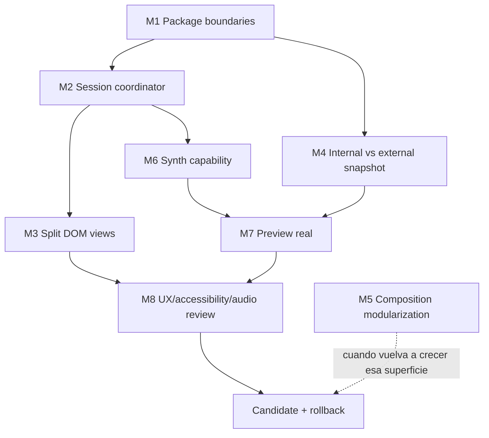

# ABCoda: plan de implementación y migración vigente

> Estado: plan ejecutable sobre una reconstrucción ya avanzada  
> Rama: `architecture-v2`  
> Baseline legacy: `ae361541f05fd52abbd0fe1dc0f1240e3d627320`  
> Base auditada de este documento: `540890c718f7f20c320cb4f8566f214fbd75e9c8`  
> Arquitectura normativa: [ABCoda: arquitectura vigente](./ABCoda-arquitectura-objetivo.md)  
> Estado operativo: [migration/STATUS.md](../migration/STATUS.md)  
> Matriz viva: [migration/CAPABILITIES.md](../migration/CAPABILITIES.md)

## 1. Qué es este documento ahora

El plan original se redactó antes de crear `architecture-v2`. Muchas de sus fases ya ocurrieron y algunas decisiones cambiaron al encontrar evidencia real.

Este documento ya no dice “qué habría que construir si empezásemos mañana”. Dice:

- qué partes de la reconstrucción están materializadas;
- qué decisiones del plan original siguen siendo normativas;
- qué puertas debemos reabrir porque la implementación real no cumple todavía el estándar prometido;
- qué trabajo debe hacerse antes de convertir `architecture-v2` en candidata;
- qué trabajo puede esperar sin degradar la arquitectura.

La prioridad ya no es mover más código a carpetas nuevas. Es **cerrar fronteras, deuda de coordinación, calidad del candidato y evidencia de paridad**.

## 2. Resultado buscado

La rama será candidata cuando disponga de:

1. dominio musical independiente de infraestructura;
2. codec ABC source-preserving suficiente para el corpus real;
3. contratos públicos versionados y compatibilidad deliberada;
4. Worker seguro y probado en workerd;
5. widget con estado y efectos con propietario explícito;
6. grabado, audio, edición, instrumentos y navegación estables;
7. límites de paquete reales;
8. evidencia visual y de navegador reproducible;
9. preview integrado fuera de producción;
10. procedimiento de sustitución y rollback.

Compilar, reproducir una demo o tener muchos tests no basta si una frontera arquitectónica importante sigue siendo ficticia.

## 3. Estado de las fases originales

| Fase | Estado auditado | Lectura actual |
|---|---|---|
| 0. Congelar y caracterizar | **complete** | Baseline y matriz de capacidades existen; legacy funciona como referencia histórica, no como dependencia. |
| 1. Esqueleto y dependencias | **reopened** | Workspaces, lint y CI existen, pero ARCH-01 demuestra que las fronteras entre paquetes todavía se atraviesan con imports directos a `src`. |
| 2. Contratos y modelo canónico | **implemented, debt** | Contratos y modelo existen; debe separarse el snapshot interno del DTO público versionado. |
| 3. Codec y diagnósticos | **complete for current corpus** | Parser, source ranges, opaque nodes, validación, round-trip y operaciones funcionan para el alcance actual. No significa “ABC completo”. |
| 4. Casos de uso | **complete for current scope** | `PrepareComposition`, `EvaluateScore`, `PresentScore`, operaciones y export ABC existen detrás de puertos. |
| 5. MCP y Worker seguro | **implemented, preview pending** | Seguridad, MCP, recurso y workerd están cubiertos; falta validación del preview público real y cierre operativo. |
| 6. Shell y bridge | **reopened for architecture cleanup** | HostBridge/controladores existen, pero `main.ts` conserva coordinación mutable transversal y `DomWidgetView` ha crecido demasiado. |
| 7. Grabado | **implemented** | Reflow, cursor, selección, multivoz y pruebas browser existen. Mantener regresiones al refactorizar vistas/coordinador. |
| 8. Reproducción | **implemented, hardening pending** | Transporte y carreras están cubiertos; falta audición humana final y caracterizar la capacidad técnica del SoundFont independientemente de tesitura musical. |
| 9. Instrumentos y edición | **implemented for current scope** | Editor revisionado, transposición por voz/global, mix persistente y política `usual/extended/unplayable` están implementados. |
| 10. Paridad, UX y robustez | **in progress** | CI browser y screenshots existen; faltan cierre de deuda arquitectónica, accesibilidad manual, audición, preview y clasificación final. |
| 11. Candidato y sustitución | **pending** | No se sustituye `main` hasta cerrar las puertas descritas abajo. |

Reabrir una fase no invalida el trabajo hecho. Significa que la evidencia real mostró una condición de salida que el estado anterior había dado por cerrada demasiado pronto.

## 4. Trabajo prioritario antes de añadir grandes features

### M1. Hacer reales las fronteras de workspace

**Problema:** paquetes con nombres `@abcoda/*` y `exports` públicos siguen siendo consumidos mediante rutas relativas a `packages/.../src`.

**Trabajo:**

- declarar dependencias `workspace:*` en cada `package.json` consumidor;
- sustituir imports inter-package por `@abcoda/domain`, `@abcoda/application`, `@abcoda/abc-codec`, `@abcoda/contracts` y `@abcoda/composition`;
- impedir con ESLint imports a `packages/*/src/**` desde otro workspace;
- mantener imports relativos únicamente dentro del propio paquete;
- comprobar que los paquetes pueden typecheckear con sus APIs públicas.

**No hacer:** crear un sistema de build de paquetes complejo si TypeScript/Vite ya resuelven los workspaces. El objetivo es frontera, no ceremonia.

**Gate M1:** CI falla ante un import interno cruzado deliberado.

### M2. Extraer coordinación de sesión de `main.ts`

**Problema:** `main.ts` sigue poseyendo estado transversal como pitches observados, presentación del host, revisión de cursor y datos de reflow, además de coordinar score, draft, playback, mix y cursor.

**Trabajo:**

- crear `WidgetSessionCoordinator` o equivalente;
- mover allí únicamente el estado que cruza controladores;
- conservar `ScoreSessionController`, `DraftSessionController`, `PlaybackSessionController`, `VoiceMixController` y `ScoreCursorController`;
- mantener adaptadores fuera del coordinador;
- reducir `main.ts` a creación de dependencias, binding inicial y teardown;
- probar continuidad de instrumento/mute, transposición, reflow, playback y host snapshot durante el refactor.

**No hacer:** sustituir los controladores por un reducer gigante solo porque el documento antiguo lo proponía. La propiedad explícita importa más que el patrón nominal.

**Gate M2:** ninguna variable mutable de sesión relevante queda en ámbito de módulo de `main.ts`.

### M3. Dividir `DomWidgetView`

**Problema:** una vista única concentra demasiadas superficies y se convierte en punto de fricción para cualquier cambio UI.

**Trabajo orientativo:**

- `WidgetShellView`;
- `ScoreView`;
- `TransportView`;
- `MixerView`;
- `EditorView`;
- mantener `DomScoreCursor` y `dom-range-presentation` como piezas específicas.

Las vistas reciben estado y emiten acciones. No deben importar políticas musicales para decidir tesitura, compatibilidad o reproducción.

**Gate M3:** añadir un control al mixer no exige editar código del editor o del transporte salvo composición explícita.

### M4. Separar snapshot interno y contrato externo

**Problema:** el tipo de dominio `ScoreSnapshot` incorpora `schemaVersion: 2`.

**Trabajo:**

- introducir una proyección interna revisionada sin versión de protocolo;
- mantener `ScoreSnapshotDto` y sus schemas en `packages/contracts`;
- crear adaptadores explícitos dominio/aplicación ↔ contrato;
- eliminar cualquier razón para que `domain` cambie cuando se publique schema 3.

**Gate M4:** un cambio artificial de `schemaVersion` externo no requiere modificar `packages/domain`.

### M5. Modularizar `packages/composition`

**Problema:** el conocimiento sigue correctamente aislado del dominio de partitura, pero su fichero principal ya es demasiado grande.

**Trabajo:** separar internamente catálogos, políticas, ensamblador de plan, review plan e instrucciones. Mantener una API pública pequeña desde `index.ts`.

**Gate M5:** los golden prompts y combinaciones existentes pasan sin cambios no explicados.

M5 es menos urgente que M1-M4 y puede ejecutarse cuando se vuelva a trabajar activamente en composición.

## 5. Hardening funcional del candidato

### M6. Capacidad del sintetizador separada de tesitura musical

La política musical ya diferencia:

- `usual`;
- `extended`;
- `unplayable`;
- presets sin frontera física (`unbounded`);
- percusión.

Queda garantizar que el adaptador audio conozca o gestione de forma segura la **capacidad técnica del backend** sin convertirla en musicología.

**Trabajo:**

- caracterizar cómo el SoundFont usado responde a pitches extremos por programa;
- definir una política de síntesis segura en el adaptador;
- evitar requests imposibles antes de sample loading;
- no eliminar eventos del timeline;
- mantener notas musicalmente válidas aunque el backend necesite una estrategia técnica distinta;
- probar instrumentos `unbounded`, que ya no reciben accidentalmente protección de un hard range musical.

**Gate M6:** ninguna nota puede provocar un request de muestra imposible sin que el adaptador lo gestione de forma determinista.

### M7. Preview real de Worker/MCP Apps

**Trabajo:**

- desplegar preview separado de producción;
- verificar Origin/Host reales del host objetivo;
- probar `/health`, `/mcp` y recurso UI sobre el artefacto construido;
- comprobar CSP y carga de muestras;
- registrar SHA, appVersion, schemaVersion, rulesVersion y artifactHash;
- verificar que no se filtra ABC/prompts a logs;
- probar fallback de herramientas sin UI.

**Gate M7:** el mismo artefacto probado en preview puede identificarse y redeplegarse sin recompilar cambios.

### M8. Accesibilidad, UX y audio humanos

Automatización obligatoria ya existente o a mantener:

- teclado y foco;
- mobile/desktop;
- light/dark;
- forced colors;
- zoom;
- overflow;
- screenshots diagnósticos;
- estados de tesitura;
- carreras de playback y edición.

Revisión humana final:

- audición de instrumentos, mute, tempo, pause/resume, seek y rangos;
- lector de pantalla o equivalente para controles críticos;
- densidad del dock móvil;
- legibilidad del mixer y advertencias;
- edición durante una sesión real;
- comportamiento dentro del host MCP Apps, no solo standalone.

**Gate M8:** no existen defectos críticos/altos conocidos de interacción, audio o accesibilidad.

## 6. Cierre de paridad

Antes de candidato, `docs/migration/CAPABILITIES.md` debe clasificar cada CAP como:

- `parity-proven`;
- `intentionally-changed`;
- `deferred` con decisión explícita.

`implemented-v2` no basta para el cierre final si la capacidad depende de audio, host real o juicio visual que aún no se haya comprobado.

Los FIX deben ser `closed` o tener aceptación explícita. En particular, FIX-04 vuelve a estar abierto hasta M2/M3, porque la concentración original de `main.ts` se redujo mucho pero la propiedad de coordinación todavía no está completamente encapsulada.

## 7. Qué no hay que hacer ahora

- No iniciar otra reescritura de ABCoda.
- No introducir Redux/otra librería de estado por reflejo.
- No convertir cada carpeta en un paquete.
- No implementar toda la especificación ABC antes de que un caso real lo pida.
- No convertir `usualRange` o `playableRange` en límites del SoundFont.
- No silenciar errores de samples mediante `try/catch` como flujo normal.
- No borrar eventos de audio para conseguir silencio.
- No añadir más responsabilidades grandes a `main.ts` o `DomWidgetView` antes de M2/M3.
- No copiar cambios legacy textualmente si rompen la nueva dirección de dependencias.
- No declarar una fase `complete` solo porque CI esté verde si su puerta arquitectónica sigue incumplida.

## 8. Evolución del codec

El codec actual es deliberadamente incremental y conserva construcciones desconocidas cuando puede hacerlo sin corrupción.

Antes de ampliar una transformación:

1. añadir fixture real;
2. comprobar parseo/source ranges;
3. decidir si el modelo actual contiene semántica suficiente;
4. enriquecer el evento si hace falta;
5. transformar desde el evento parseado;
6. comprobar round-trip e inversa cuando proceda.

Si una feature exige regex cada vez más globales sobre `document.source.text`, eso es señal de que el modelo necesita crecer antes de la feature.

## 9. Política de commits para los próximos cortes

Cada commit debe cerrar una idea verificable. Ejemplos:

```text
refactor(workspaces): consume package public exports
refactor(widget): own cross-controller state in session coordinator
refactor(widget): split mixer and editor DOM views
refactor(domain): separate protocol snapshot from revisioned score
refactor(composition): split catalog and review policy modules
test(audio): characterize soundfont pitch capability
ops(preview): document validated architecture-v2 artifact
```

Evitar commits del tipo `cleanup architecture`, `refactor everything` o mezclas de los cinco milestones en un solo diff.

## 10. Definición de terminado por corte

Un corte está terminado cuando:

1. preserva o cambia deliberadamente comportamiento;
2. tiene prueba proporcional al riesgo;
3. mantiene las dependencias en la dirección correcta;
4. no deja estado o efecto sin propietario;
5. maneja error/cancelación cuando aplica;
6. CI queda verde;
7. aporta screenshot si modifica UI relevante;
8. actualiza `STATUS.md`/`CAPABILITIES.md` si cambia una puerta o una CAP;
9. no depende de “ya lo arreglaremos después” para ser coherente;
10. puede revertirse sin arrastrar trabajo no relacionado.

## 11. Orden recomendado desde el estado actual



M1 y M4 son principalmente server/paquetes. M2 y M3 son principalmente widget. Pueden ejecutarse con cierto paralelismo si cada corte mantiene CI verde.

## 12. Checklist de candidato

- [ ] imports inter-workspace solo a APIs públicas;
- [ ] dependencias workspace declaradas;
- [ ] `main.ts` sin estado transversal de sesión;
- [ ] vistas DOM separadas por responsabilidad;
- [ ] snapshot interno desacoplado de schema externo;
- [ ] dominio sin MCP, Cloudflare, DOM, abcjs o Zod;
- [ ] Worker sin código de synth/grabado;
- [ ] tunebooks múltiples tratados explícitamente;
- [ ] transposición/percussion/rangos cubiertos por regresiones;
- [ ] synth capability gestionada por adaptador;
- [ ] Worker y MCP probados en preview real;
- [ ] herramientas útiles sin UI;
- [ ] screenshots desktop/mobile y light/dark revisados;
- [ ] forced colors, zoom y teclado comprobados;
- [ ] audición humana final completada;
- [ ] accesibilidad manual crítica completada;
- [ ] CAP/FIX cerradas o deliberadamente diferidas;
- [ ] artefacto candidato identificado por hash y SHA;
- [ ] rollback probado;
- [ ] aprobación explícita antes de sustituir `main`.

## 13. Después del candidato

Solo después de cerrar la reconstrucción conviene ampliar superficie con features grandes como:

- solo/volumen por voz;
- export MIDI;
- MusicXML/PDF opcionales;
- samples propios/subsetted;
- persistencia;
- colaboración;
- familias instrumentales más específicas;
- operaciones musicales más sofisticadas.

Cada una debe entrar por los puertos existentes o justificar un ADR nuevo. Ninguna es razón para volver a mezclar dominio, MCP, DOM y audio.

## 14. Conclusión

El plan original acertó en lo esencial: reconstrucción incremental, dominio puro, codec explícito, Worker como adaptador, laboratorio UI temprano y pruebas en runtime real. La implementación ha validado esa dirección.

La corrección necesaria ahora no es una tercera arquitectura. Es más incómoda y bastante más útil: **terminar de cumplir la segunda**.

Eso implica hacer reales las fronteras workspace, encapsular la coordinación del widget, dividir la vista DOM, separar protocolo y dominio, y cerrar la calidad operativa del candidato. Después de eso, ABCoda podrá crecer sin que cada feature vuelva a convertir el proyecto en una negociación entre `main.ts`, regex y plegarias.
