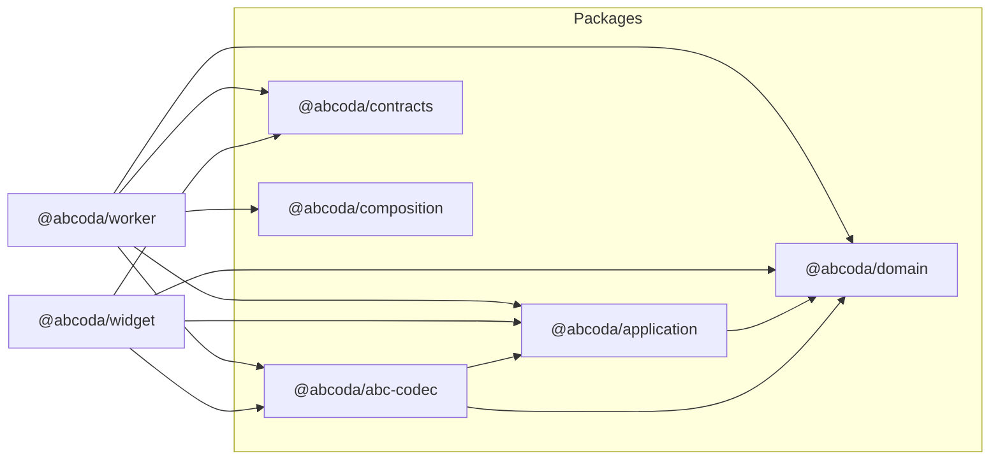

# ARCH-01 · Fronteras reales de workspace

> Documento temporal de trabajo. Debe eliminarse cuando ARCH-01 pase implementación, regresión y auditoría final.

## 1. Diferencia entre arquitectura deseada y actual

### Arquitectura deseada

Los directorios `packages/*` y `apps/*` son workspaces de npm con fronteras explícitas. La relación entre módulos debe expresarse mediante sus APIs públicas:

```ts
import { EvaluateScore } from "@abcoda/application";
import { CanonicalAbcCodec } from "@abcoda/abc-codec";
import { instrumentDefinition } from "@abcoda/domain";
```

Cada consumidor declara la dependencia en su `package.json`. Un workspace no alcanza el `src/` de otro mediante rutas relativas.

### Arquitectura encontrada

La prueba de caracterización reforzada encontró **30 imports privados cruzados**, pero ninguna dependencia en dirección prohibida y ningún ciclo. El problema es de encapsulación física, no de inversión del grafo lógico.

Ejemplo anterior:

```ts
import { EvaluateScore } from "../../../../packages/application/src/index";
```

Esto provocaba que:

1. un refactor interno de carpetas rompiese consumidores ajenos;
2. `package.json` no expresase el grafo real;
3. las reglas de arquitectura tuviesen que interpretar rutas relativas en vez de APIs estables.

## 2. Resultado refactorizado



### Dependencias permitidas

| Workspace | Dependencias internas permitidas |
|---|---|
| `@abcoda/domain` | ninguna |
| `@abcoda/application` | `@abcoda/domain` |
| `@abcoda/abc-codec` | `@abcoda/application`, `@abcoda/domain` |
| `@abcoda/contracts` | ninguna |
| `@abcoda/composition` | ninguna |
| `@abcoda/widget` | application, abc-codec, contracts, domain |
| `@abcoda/worker` | application, abc-codec, composition, contracts, domain |

Los workspaces siguen siendo privados y sus `exports` apuntan a fuente TypeScript. No se introduce un build/publicación de paquetes que el producto no necesita.

### Dependencias de manifiesto

Las dependencias internas se declaran mediante la versión local `0.0.0`. npm las resuelve contra los workspaces enlazados y el lockfile registra el grafo. También se declaran las dependencias externas realmente consumidas directamente por cada workspace (`zod`, `abcjs`, MCP Apps/SDK), aunque sigan estando disponibles hoisted desde la raíz para el código legacy.

## 3. Restricción automática implementada

`tests/v2/architecture-boundaries.test.ts` comprueba:

1. el grafo permitido entre workspaces;
2. ausencia de imports relativos que alcancen otro workspace;
3. uso exclusivo de dependencias `@abcoda/*` permitidas;
4. declaración en el manifiesto de todo workspace público consumido;
5. dependencias externas intencionales de los paquetes de núcleo;
6. ausencia de ciclos.

Se decidió **no duplicar esta lógica con un glob ESLint frágil**. ESLint conserva las restricciones tecnológicas inmediatas de dominio/aplicación/widget; la prueba estructural resuelve rutas reales y es la fuente de verdad para fronteras entre workspaces. Añadir dos mecanismos con semánticas de glob distintas produciría dos definiciones de la misma arquitectura, exactamente el tipo de drift que ARCH-01 pretende eliminar.

## 4. Refactorización ejecutada

1. Se añadió primero la prueba estructural reforzada.
2. CI falló de manera controlada y enumeró los 30 imports privados existentes.
3. Un codemod determinista sustituyó únicamente esos imports por `@abcoda/*`.
4. El codemod exigió encontrar exactamente 30 ocurrencias; cualquier diferencia habría abortado la operación.
5. Se actualizaron los `package.json` consumidores y las dependencias externas directas.
6. `npm install --package-lock-only --ignore-scripts` regeneró la sección de workspaces del lockfile.
7. La prueba arquitectónica pasó dentro del runner antes de permitir el commit mecánico.
8. El commit resultante es `741d1f8ab8ca3e5749d9d9f0d7114b960f6c885d` (`refactor(workspaces): consume public package exports`).
9. Falta en este punto ejecutar el gate integral y realizar la auditoría posterior contra este mismo documento.

## 5. Pruebas de regresión

### Arquitectura

- La caracterización previa demostró que un import privado cruzado hace fallar el gate.
- El gate actual exige manifiestos coherentes con imports públicos.
- El grafo conserva su dirección y no contiene ciclos.

### Compilación y runtime pendientes de gate integral

- `npm ci` debe aceptar el lockfile sin regenerarlo.
- `npm run lint` y `npm run typecheck` deben pasar.
- unitarias v2 y legacy deben seguir verdes.
- Worker workerd debe resolver los workspaces mediante sus exports públicos.
- builds v2 y legacy deben seguir funcionando.
- Playwright debe pasar completo porque este refactor no modifica comportamiento ni UI.

## 6. Auditoría posterior requerida

Tras el gate integral se comprobará de nuevo:

- que no queda ningún import relativo hacia otro workspace;
- que no existe un import `@abcoda/*` no declarado;
- que no se ha creado ningún ciclo;
- que la API pública de cada workspace es suficiente y ningún consumidor necesita volver a entrar en `src`;
- que el cambio no ha introducido comportamiento observable.

Si alguna de estas condiciones falla, se distingue entre:

- **fallo de diseño:** la API pública o el grafo esperado eran insuficientes; volver a §2/§3;
- **fallo de implementación:** el diseño sigue siendo correcto pero alguna sustitución/manifiesto es incorrecto; volver a §4.

## 7. Criterios de aceptación

ARCH-01 queda cerrado solo si:

- ningún import de código v2 atraviesa el `src` de otro workspace;
- todo workspace consumidor declara sus dependencias directas;
- CI impide reintroducir la violación;
- el grafo sigue sin ciclos;
- `npm ci`, tipos, lint, unitarias, workerd, builds y Playwright pasan;
- la auditoría posterior coincide con este diseño.

Solo después se eliminan este documento y la automatización temporal del codemod.