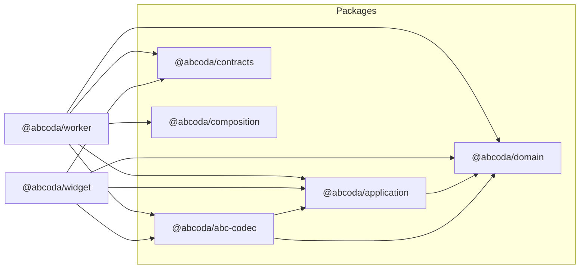

# ARCH-01 · Fronteras reales de workspace

> Documento temporal de trabajo. Debe eliminarse cuando ARCH-01 pase implementación, regresión y auditoría final.

## 1. Diferencia entre arquitectura deseada y actual

### Arquitectura deseada

Los directorios `packages/*` y `apps/*` son workspaces de npm con fronteras explícitas. La relación entre módulos debe expresarse mediante sus APIs públicas:

```ts
import { EvaluateScore } from "@abcoda/application";
import { CanonicalAbcCodec } from "@abcoda/abc-codec";
import { instrumentDefinition } from "@abcoda/domain";
```

Cada consumidor declara la dependencia en su `package.json`. Un workspace no alcanza el `src/` de otro mediante rutas relativas. ESLint y una prueba estructural deben impedir que esa situación reaparezca.

### Arquitectura actual

Los workspaces existen y tienen `name`/`exports`, pero varios consumidores atraviesan directamente la implementación de otros paquetes, por ejemplo:

```ts
import { EvaluateScore } from "../../../../packages/application/src/index";
```

La dirección conceptual de dependencias es mayoritariamente correcta, pero la frontera pública es evitable. Esto crea tres problemas:

1. un refactor interno de carpetas rompe consumidores ajenos;
2. `package.json` no expresa necesariamente el grafo real;
3. las reglas de arquitectura dependen de interpretar rutas relativas en vez de APIs estables.

## 2. Resultado refactorizado



### Dependencias permitidas

| Workspace | Dependencias internas permitidas |
|---|---|
| `@abcoda/domain` | ninguna |
| `@abcoda/application` | `@abcoda/domain` |
| `@abcoda/abc-codec` | `@abcoda/application`, `@abcoda/domain` |
| `@abcoda/contracts` | ninguna |
| `@abcoda/composition` | ninguna |
| `@abcoda/widget` | application, abc-codec, contracts, domain |
| `@abcoda/worker` | application, abc-codec, composition, contracts, domain |

No se pretende convertir cada carpeta del widget en paquete ni introducir builds de publicación. Los workspaces siguen siendo privados y TypeScript/Vite consumen sus `exports` fuente.

## 3. Restricciones automáticas

La prueba `tests/v2/architecture-boundaries.test.ts` debe verificar:

1. el grafo entre paquetes continúa apuntando hacia dentro y no tiene ciclos;
2. ningún fichero bajo `packages/*/src` o `apps/*/src` importa mediante ruta relativa un fichero de otro workspace;
3. los imports `@abcoda/*` usados por código fuente pertenecen al conjunto permitido para ese workspace;
4. todo import `@abcoda/*` usado por un workspace figura en `dependencies` de su `package.json`;
5. el dominio y la aplicación mantienen las restricciones tecnológicas existentes.

ESLint añadirá además una prohibición simple sobre rutas que crucen hacia `packages/*/src`, de modo que el feedback durante edición sea inmediato. La prueba estructural sigue siendo la garantía de repositorio porque resuelve rutas y conoce el propietario de cada fichero.

## 4. Plan de refactorización

1. Endurecer la prueba arquitectónica para detectar imports privados cruzados y dependencias no declaradas.
2. Ejecutarla en CI para obtener la lista exhaustiva de violaciones actuales.
3. Sustituir cada import inter-workspace por el nombre público `@abcoda/*` sin cambiar símbolos ni comportamiento.
4. Declarar dependencias workspace en `package.json` de application, abc-codec, widget y worker.
5. Actualizar `package-lock.json` de forma coherente con esos manifiestos.
6. Añadir regla ESLint para impedir futuros imports privados entre workspaces.
7. Ejecutar `npm run check` y la suite browser completa.
8. Auditar de nuevo el árbol: no debe quedar ningún import privado cruzado ni dependencia `@abcoda/*` sin declarar.
9. Si la auditoría coincide con este diseño, actualizar estado arquitectónico y eliminar este documento temporal.

## 5. Pruebas de regresión

### Arquitectura

- La prueba estructural falla si se introduce deliberadamente `../../domain/src/index` desde application.
- La prueba falla si widget importa un workspace no permitido.
- La prueba falla si se usa `@abcoda/domain` sin declararlo en el manifiesto del consumidor.
- El grafo no contiene ciclos.

### Compilación y runtime

- `npm ci` debe aceptar el lockfile sin regenerarlo.
- `npm run lint` y `npm run typecheck` pasan.
- unitarias v2 pasan sin cambios semánticos.
- Worker workerd pasa usando los nombres de paquete.
- build v2 Worker y widget resuelven los workspaces.
- Playwright pasa completo, ya que el cambio no debe alterar UI ni comportamiento.

## 6. Criterios de aceptación

ARCH-01 queda cerrado solo si:

- ningún import de código v2 atraviesa el `src` de otro workspace;
- todo workspace consumidor declara sus dependencias internas;
- CI impide reintroducir ambas clases de violación;
- el grafo sigue sin ciclos;
- todos los tests/builds previos siguen verdes.

No se considera suficiente que Vite o TypeScript “lo resuelvan igualmente”: el objetivo es convertir la arquitectura lógica en una restricción física del repositorio.