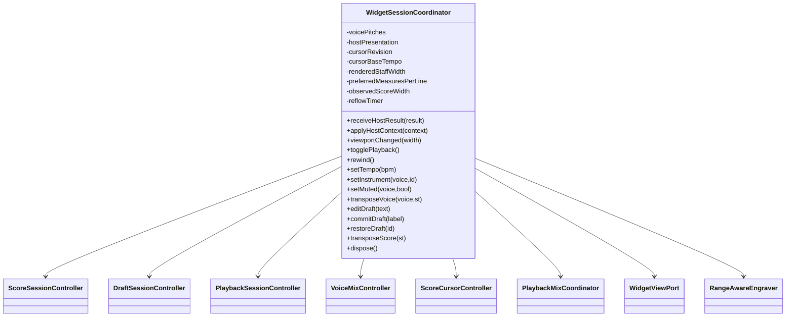
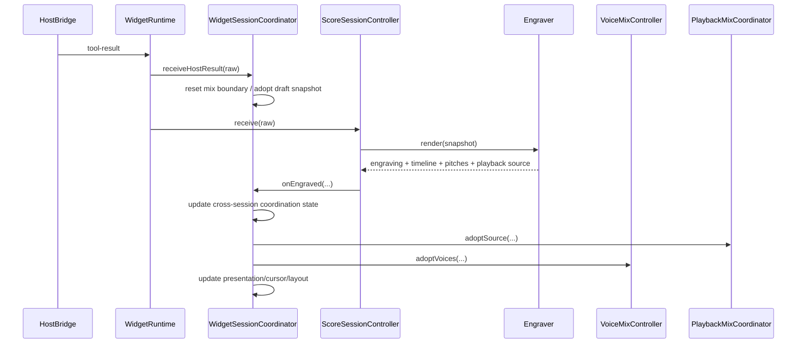

# ARCH-02 · Propiedad de la coordinación de sesión del widget

> Documento temporal. Se elimina únicamente después de implementación, regresión y auditoría final.

## 1. Diferencia entre arquitectura deseada y actual

### Deseada

Los controladores especializados siguen siendo propietarios de su estado local:

- `ScoreSessionController`: snapshot activo, efecto de grabado y revisión;
- `DraftSessionController`: draft, historial, validación y último válido;
- `PlaybackSessionController`: motor, tempo, loop y estado play/pause;
- `VoiceMixController`: instrumento y mute por voz;
- `ScoreCursorController`: timeline, selección y seguimiento visual.

El estado que **relaciona** varios de esos subsistemas debe pertenecer a un coordinador explícito. `main.ts` debe limitarse a crear adaptadores, construir el coordinador, enlazar eventos DOM y hacer teardown.

### Actual

`main.ts` contiene y muta directamente:

```text
cursorBaseTempo
voicePitches
hostPresentation
cursorRevision
renderedStaffWidth
activePreferredMeasuresPerLine
reflowTimer
observedScoreWidth
```

Además, callbacks de score, playback, mix, engraver, host y ResizeObserver se llaman mutuamente mediante closures sobre esas variables.

No es un monolito comparable al legacy, pero sí existe un **segundo store implícito** en el composition root. El problema no es el número de líneas sino que la propiedad de relaciones importantes no puede probarse sin arrancar todo `main.ts`.

## 2. Decisión de diseño

No se sustituirán los controladores por un reducer global. La evidencia de la implementación favorece controladores pequeños y explícitos.

Se introduce `WidgetSessionCoordinator` como **orquestador de relaciones**, no como nuevo propietario del estado que ya pertenece a los controladores.



## 3. Construcción sin dependencia de DOM/abcjs

El coordinador vive en `apps/widget/src/application/`. No importa `DomWidgetView`, `AbcjsEngraver`, `document`, `ResizeObserver` ni `window`.

Recibe puertos estructurales:

```ts
interface WidgetSessionView {
  showScore(state): void;
  showPlayback(state): void;
  showMix(state, assessments): void;
  showDraft(state): void;
  showPresentation(presentation, snapshot): void;
  applyHostContext(context): void;
}

interface RangeAwareEngraver extends Engraver {
  showVoiceRanges(mix: VoiceMixSnapshot): void;
}
```

Y dependencias ya creadas o factories puras cuando existe circularidad de callbacks.

### Construcción elegida

El coordinador construirá internamente los controladores de aplicación a partir de:

- `view`;
- `cursorView`;
- `engraverFactory(callbacks)`;
- `hostBridge`;
- `draftEvaluator`;
- `draftTransformer`;
- `initialViewportWidth`;
- opcionalmente funciones `setTimer/clearTimer` para pruebas deterministas.

El factory de engraver mantiene abcjs fuera de `application`: `main.ts` pasa una closure que instancia `AbcjsEngraver` usando los nodos DOM ya existentes.

## 4. Secuencia de un snapshot de host



`WidgetRuntime` continúa gobernando conexión/teardown del host. El coordinador no absorbe el bridge ni el protocolo MCP.

## 5. Reflow

El `ResizeObserver` permanece en `main.ts` porque es una API DOM. Solo observa y pasa el ancho:

```ts
coordinator.viewportChanged(width)
```

Toda la política queda dentro del coordinador:

1. ignorar cambios < 0,5 px;
2. refrescar geometría del cursor inmediatamente;
3. comparar `scoreStaffWidth` con el último ancho grabado;
4. cancelar timer anterior;
5. programar reflow estable a 320 ms;
6. volver a medir mediante `getViewportWidth()` antes de renderizar;
7. llamar `ScoreSessionController.reflow()` solo si cambia el staff width.

`main.ts` no conserva timer, ancho previo ni presentación.

## 6. Acciones de UI

El coordinador expone métodos finos que delegan al propietario correcto. Ejemplos:

```text
togglePlayback -> PlaybackSessionController
rewind          -> PlaybackSessionController + ScoreCursorController
setInstrument   -> VoiceMixController
transposeVoice  -> DraftSessionController
setTempo        -> PlaybackSessionController
```

Esto permite que `main.ts` haga bindings declarativos sin conocer relaciones internas.

## 7. Plan de refactorización

1. Añadir tests de caracterización del coordinador esperado antes de mover `main.ts`.
2. Crear interfaces `WidgetSessionView`, `RangeAwareEngraver` y factory de engraver.
3. Implementar `WidgetSessionCoordinator` trasladando literalmente las relaciones actuales.
4. Mantener constantes de comportamiento: 96 BPM default, debounce 320 ms, draft debounce 700 ms, umbral de ancho 0,5 px.
5. Simplificar `main.ts` a adapters + coordinator + ResizeObserver + bindings + pagehide.
6. Ejecutar unitarias centradas en coordinador.
7. Ejecutar `npm run check` y Playwright completo.
8. Revisar que no quede estado mutable de sesión en módulo `main.ts`.
9. Comparar callbacks/orden de efectos con este documento.
10. Si falla comportamiento, determinar si la relación estaba mal trasladada (implementación) o si el coordinador asumió propiedad incorrecta (diseño).

## 8. Regresiones obligatorias

### Unitarias nuevas

- Un nuevo host snapshot limpia mix de la composición anterior antes de adoptar voces nuevas.
- `loading/invalid/failed` limpian playback source y audio igual que antes.
- Una grabación de contenido actualiza timeline, base tempo, source de playback, pitches, mix y presentación en ese orden lógico.
- Un reflow no reconstruye playback ni mix; solo reaplica rango visual.
- Cambios de width inferiores al umbral no programan reflow.
- Cambios reales cancelan el reflow anterior y publican uno solo.
- `dispose()` cancela timer, draft/runtime/playback y fuente de mix.

### Regresión existente

- carreras de snapshot y reflow;
- mix persistente durante transposición;
- instrumento/mute durante play y pause;
- tempo/loop/seek;
- cursor envuelto tras resize;
- tesituras visuales;
- móvil/escritorio;
- host standalone y MCP Apps.

## 9. Auditoría final

Se considerará ARCH-02 cerrado si:

- `main.ts` no contiene `let` para estado de sesión;
- no contiene `setTimeout` de reflow;
- no calcula rangos, continuidad, tempo base o adopción de mix;
- `WidgetSessionCoordinator` no importa DOM, abcjs ni adaptadores concretos;
- cada controlador especializado sigue siendo dueño de su estado;
- el coordinador solo posee estado transversal identificado en §1;
- las pruebas permiten verificar esas relaciones sin arrancar DOM;
- el comportamiento browser permanece sin regresiones.

Si el coordinador se convierte en una god class que reimplementa la lógica interna de los controladores, el diseño se considera fallido y se vuelve a §2 antes de seguir.