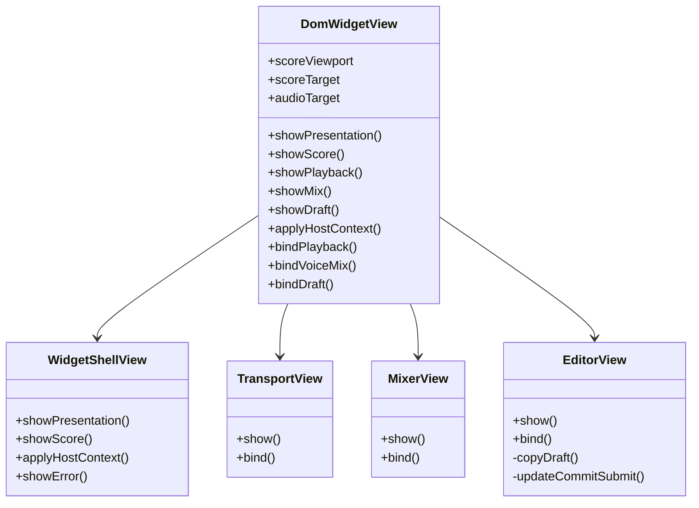
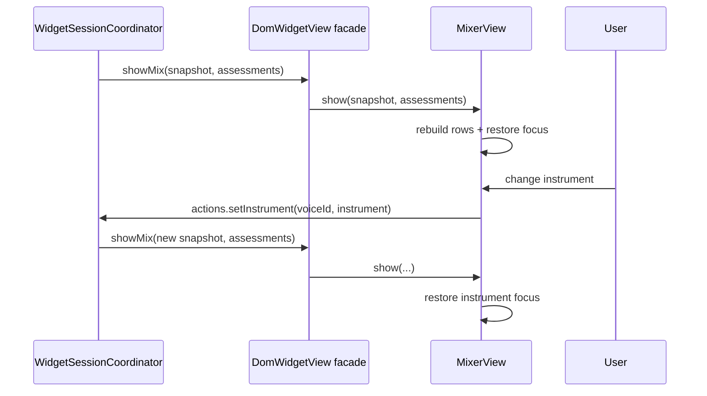

# ARCH-03 · Descomposición de `DomWidgetView`

> Documento temporal. Se elimina únicamente después de implementación, regresión y auditoría final.

## 1. Diferencia entre arquitectura deseada y actual

### Arquitectura deseada

Las vistas DOM son adaptadores pasivos con cohesión alta. Cada vista:

- conoce únicamente los elementos DOM de su superficie;
- recibe estado ya calculado por application;
- emite acciones tipadas;
- no decide reglas musicales;
- puede modificarse sin obligar a tocar superficies UI no relacionadas.

La fachada que consume `WidgetSessionCoordinator` puede seguir siendo única, pero debe delegar en vistas pequeñas.

### Arquitectura actual

`DomWidgetView` concentra en una sola clase:

1. shell, estado global, título y errores;
2. contexto del host, tema, safe-area y display mode;
3. play/pause, rewind, loop y tempo;
4. construcción completa del mixer por voz;
5. instrumento, mute y transposición por voz;
6. editor ABC;
7. estado y diagnósticos del draft;
8. historial de versiones;
9. formulario de commit;
10. clipboard y feedback temporal;
11. transposición global.

También mantiene estado mutable específico de editor/mixer (`voiceMixActions`, `copyResetTimer`, `draftStatus`).

Eso no viola la dirección de dependencias, pero sí la responsabilidad única: tocar el mixer exige abrir un fichero que conoce clipboard y commits; tocar copy conoce indirectamente transporte porque vive en el mismo objeto.

## 2. Resultado objetivo



`DomWidgetView` queda como **facade adapter**. Esto es intencional: `WidgetSessionView` no debe depender de cuatro vistas concretas ni `main.ts` empezar a conocer la estructura interna del DOM.

## 3. Responsabilidades exactas

### 3.1 `WidgetShellView`

Propiedad DOM:

- `#score-shell` se expone por la fachada, pero no necesita ser gestionado por shell;
- `#status`;
- `#score-title`;
- `#error`;
- `document.body.dataset.state`;
- `document.documentElement` para theme/display/safe areas.

Métodos:

```ts
showPresentation(presentation, snapshot)
showScore(state)
applyHostContext(context)
showError(message)
```

El error debe ser reutilizable desde `TransportView` cuando playback falla. Para evitar acoplar transport a shell concreto, `TransportView` recibe `reportError(message)`.

### 3.2 `TransportView`

Propiedad DOM:

- `#playback` + `.play-icon` + `.pause-icon`;
- `#rewind`;
- `#loop`;
- `#tempo`;
- `#tempo-value`.

Responsabilidad:

- proyectar `PlaybackSessionState`;
- sincronizar slider/campo;
- emitir `PlaybackActions`;
- desmontar listeners simétricamente.

No conoce score, mixer, draft ni host context.

### 3.3 `MixerView`

Propiedad DOM:

- `#mixer`;
- `#voice-mix`.

Responsabilidad:

- construir una fila por voz;
- preservar foco por `voiceId`/rol;
- poblar instrumentos usando `instrumentsForVoice`;
- crear mute icon;
- crear transposición por voz;
- presentar warning textual recibido desde `VoiceRangeAssessment`;
- emitir `VoiceMixActions`.

`MixerView` puede depender de `@abcoda/domain` para el catálogo de instrumentos porque es un adapter de presentación que recibe una política ya decidida por dominio. No puede clasificar pitches ni decidir compatibilidad/rangos por su cuenta.

### 3.4 `EditorView`

Propiedad DOM:

- `#editor`, `#editor-state`, `#abc-draft`, `#draft-diagnostics`;
- `#version-history`, `#version-picker`;
- controles de commit;
- controles de copy;
- `#global-transpose`.

Estado interno permitido:

- `draftStatus` exclusivamente para habilitar commit;
- `copyResetTimer` exclusivamente para feedback visual;
- timer hover/focus del picker vive en el binding y se elimina en teardown.

Responsabilidad:

- proyectar `DraftSessionState`;
- construir historial/diagnósticos;
- emitir edit/restore/commit/transpose;
- clipboard como efecto DOM local iniciado por gesto de usuario;
- feedback de copy;
- formulario de commit.

No conoce playback, mixer, score session ni host.

## 4. DOM y compatibilidad visual

**No se modifica el HTML.** Cada subview busca exactamente los IDs que la clase actual usa.

No se cambian:

- IDs;
- clases;
- `data-*`;
- aria labels/pressed/busy/selected;
- títulos;
- orden de nodos del mixer;
- comportamiento de focus restoration;
- tiempos de UI (`180 ms` picker, `1400 ms` copy);
- icon paths;
- texto visible;
- API pública de `DomWidgetView`.

Esto convierte la suite Playwright y sus screenshots en una regresión muy fuerte para ARCH-03.

## 5. Diagrama de secuencia del mixer



## 6. Plan de refactorización

1. Añadir prueba arquitectónica que exija la fachada y cuatro subviews, sin imponer detalles arbitrarios de líneas.
2. Extraer helper compartido mínimo `requiredElement`/`requiredInside` para evitar duplicar comprobaciones de DOM.
3. Extraer `WidgetShellView` y mover estado/título/error/contexto sin alterar comportamiento.
4. Extraer `TransportView` y su binding.
5. Extraer `MixerView`, incluido `muteIcon` y foco.
6. Extraer `EditorView`, incluidos timers/clipboard/commit/versiones/transposición.
7. Reducir `DomWidgetView` a construcción de subviews, exposición de score/audio targets y delegación.
8. Mantener las interfaces `PlaybackActions`, `VoiceMixActions`, `DraftActions` en un módulo de contratos DOM o reexportarlas desde la fachada para no romper consumidores.
9. Ejecutar unitarias/markup/typecheck.
10. Ejecutar `npm run check`, smoke de rangos y Playwright completo.
11. Auditar que ninguna subview haya absorbido política de aplicación o musical.
12. Si hay regresión visual/DOM, volver a implementación; si una responsabilidad no encaja sin acoplamientos cruzados, volver al diseño.

## 7. Pruebas de regresión

### Arquitectura nueva

- `DomWidgetView` instancia/delega en `WidgetShellView`, `TransportView`, `MixerView`, `EditorView`.
- `TransportView` no importa draft/mix/domain.
- `EditorView` no importa playback/mix/domain.
- `MixerView` no importa playback/draft ni funciones `classifyInstrumentPitch`/`assessInstrumentRange`.
- ninguna subview importa abcjs.

### Funcional existente crítica

- play/pause/rewind/loop y tempo slider/text;
- instrumento y mute por voz;
- foco preservado al reconstruir mixer;
- transposición global y por voz;
- percusión con transposición deshabilitada;
- warnings y colores de rango;
- editor dirty/validating/invalid/clean;
- historial y restore;
- commit con validación y Escape;
- copy success/failure;
- host theme/display/safe-area;
- error de score y playback;
- desktop/mobile/forced colors/zoom;
- screenshots visuales existentes.

## 8. Criterios de auditoría final

ARCH-03 se cierra si:

- `DomWidgetView` es una fachada, no vuelve a implementar las cuatro superficies;
- cada subview posee solo sus elementos y estado efímero local;
- no aparece lógica musical duplicada en DOM;
- no cambia la API que usa `WidgetSessionCoordinator`;
- no cambia markup observable salvo diferencias deliberadas inexistentes en este refactor;
- todos los bindings poseen teardown simétrico;
- CI y Playwright pasan íntegramente;
- modificar `MixerView` no requiere editar `EditorView` o `TransportView`.

No se usará un límite de líneas como definición de arquitectura. Si una vista necesita 200 líneas cohesivas, partirla para satisfacer una cifra sería contabilidad estética, no diseño.