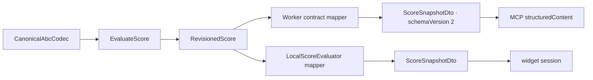

# ARCH-04 · Separar estado interno revisionado y contrato externo

> Documento temporal. Se elimina solo tras implementación, pruebas y auditoría final.

## 1. Diferencia entre arquitectura deseada y actual

### Deseada

El dominio/aplicación manejan conceptos musicales e internos. La versión de protocolo pertenece a `packages/contracts` y a los adaptadores que cruzan esa frontera.

Un cambio futuro de `schemaVersion: 2` a `schemaVersion: 3` puede cambiar DTOs y mappings, pero **no debe obligar a editar `packages/domain`** si la semántica musical interna no cambia.

### Actual

`packages/domain/src/score.ts` declara:

```ts
interface ScoreSnapshot {
  schemaVersion: 2;
  revision: RevisionId;
  document: ScoreSnapshotDocument;
  diagnostics: readonly Diagnostic[];
}
```

`packages/application` construye ese `schemaVersion: 2`, de modo que una capa que debía ignorar MCP/contratos conoce una decisión puramente externa.

Además, el nombre `ScoreSnapshot` se usa tanto para la proyección interna como para `ScoreSnapshotDto`, lo que difumina el límite.

## 2. Resultado objetivo



### Modelo interno

```ts
interface RevisionedScore {
  revision: RevisionId;
  document: ScoreProjection;
  diagnostics: readonly Diagnostic[];
}
```

`ScoreProjection` conserva la proyección compacta que ya usa application: tuneId, título, meter, key, tempo, voces y fuente ABC.

No contiene:

- `schemaVersion`;
- nombres MCP;
- Zod;
- presentation del widget;
- `_meta`.

### Contrato externo

`packages/contracts` mantiene:

```ts
ScoreSnapshotDto = {
  schemaVersion: 2,
  revision: number,
  document: ...,
  diagnostics: ...
}
```

Los schemas Zod siguen siendo la fuente de verdad de entrada/salida externa.

## 3. Resultado de aplicación

`EvaluateScore` deja de devolver una cosa llamada snapshot de protocolo:

```ts
type EvaluateScoreResult =
  | { status: "success"; score: RevisionedScore }
  | { status: "invalid"; diagnostics: readonly Diagnostic[] };
```

`PresentScore` recibe `RevisionedScore` y reevalúa su fuente/revisión. Sigue siendo un caso de uso interno y no conoce DTOs.

`ApplyScoreOperation` continúa operando sobre `ScoreDocument`; no se mezcla con esta proyección.

## 4. Mappers de borde

### Worker

El adaptador MCP contiene funciones explícitas:

```ts
function toScoreSnapshotDto(score: RevisionedScore): ScoreSnapshotDto
function fromScoreSnapshotDto(dto: ScoreSnapshotDto): RevisionedScore
function toEvaluateScoreResultDto(result: EvaluateScoreResult): EvaluateScoreResultDto
```

`validate_score`:

```text
request DTO -> EvaluateScore -> internal result -> DTO mapper -> MCP
```

`render_score` schema 2:

```text
ScoreSnapshotDto -> internal mapper -> PresentScore -> internal result -> DTO mapper
```

Compatibilidad schema 1 sigue entrando por `EvaluateScore`, y el ajuste legacy de voice kinds/presentation se aplica sobre el DTO de salida, no sobre el dominio.

### Widget local

`LocalScoreEvaluator` es un adapter. Puede convertir `EvaluateScoreResult` interno a la forma `EvaluateScoreResultDto` que espera `DraftSessionController`.

Esto evita hacer depender `packages/application` de `packages/contracts` solo para comodidad del navegador.

## 5. Diagnósticos

Los `Diagnostic` internos y `diagnosticSchema` externo tienen hoy formas equivalentes. Esa coincidencia no los vuelve el mismo concepto.

Los mappers copian campos explícitamente. No se usará `as ScoreSnapshotDto` ni spread ciego como sustituto de frontera.

## 6. Plan de refactorización

1. Añadir prueba arquitectónica: dominio no contiene `schemaVersion`, `ScoreSnapshot` ni imports de contracts.
2. Renombrar `ScoreSnapshotDocument` a `ScoreProjection` y `ScoreSnapshot` a `RevisionedScore`.
3. Cambiar `EvaluateScoreResult.success.snapshot` por `.score`.
4. Cambiar `PresentScoreCommand.snapshot` por `.score`.
5. Actualizar tests puros de application/domain.
6. Añadir mapper de contratos en `apps/worker/src/mcp/score-contract-mapper.ts`.
7. Actualizar `create-server.ts` para mapear todas las salidas v2 y entradas schema 2.
8. Adaptar la lógica legacy sobre DTO, preservando exactamente el schema público.
9. Actualizar `LocalScoreEvaluator` para mapear resultado interno a DTO del widget.
10. Ejecutar contract tests, workerd y unitarias.
11. Ejecutar `npm run check` y Playwright completo.
12. Auditar que cambiar el literal externo de schema en una copia de prueba conceptual no exige dominio/application.

## 7. Pruebas de regresión

### Arquitectura

- `packages/domain/src/score.ts` no contiene `schemaVersion` ni `ScoreSnapshot`.
- `packages/application` no importa `@abcoda/contracts`.
- mappers viven en adapters (`apps/worker`, `apps/widget/adapters/local`).
- contracts no importa domain/application.

### Contrato

- `validate_score` sigue devolviendo exactamente `schemaVersion: 2`.
- `render_score` schema 2 sigue aceptando el DTO vigente.
- `render_score` schema 1 sigue produciendo resultado compatible y presentation legacy.
- errores/diagnósticos mantienen códigos, rango y suggestedCorrection.
- roundtrip DTO -> internal -> DTO preserva contenido público.

### Widget

- evaluación local sigue publicando snapshots schema 2 al controlador del draft;
- editar/transponer/restaurar no cambia comportamiento;
- host result sigue validándose con `evaluateScoreResultSchema`.

### Suite completa

Workerd y Playwright deben permanecer verdes porque el contrato observable no cambia.

## 8. Criterio de auditoría final

ARCH-04 queda cerrado si:

- dominio/application no contienen versión de protocolo;
- el único `schemaVersion: 2` relevante al score vive en contracts/mappers/tests de contrato;
- Worker y widget traducen explícitamente la frontera;
- ningún `as` opaco sustituye al mapping;
- el schema público v2 no cambia;
- CI integral pasa.

Si separar los tipos obliga a duplicar lógica musical, el diseño es incorrecto y se vuelve a §2. Si solo aparece código repetitivo de copia de campos en adaptadores, eso es coste intencional de desacoplamiento y no debe “optimizarse” reintroduciendo la dependencia.