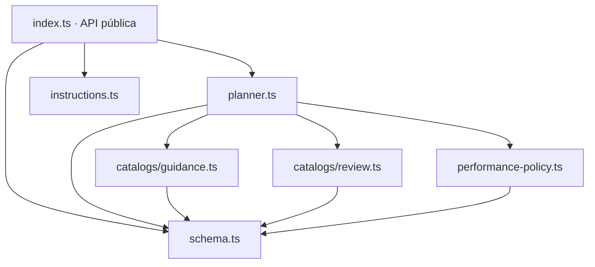

# ARCH-05 · Modularizar `packages/composition`

> Documento temporal. Se elimina solo después de implementación, regresión y auditoría final.

## 1. Diferencia entre arquitectura deseada y actual

### Deseada

`packages/composition` es un módulo de conocimiento editorial/estilístico separado del dominio de partitura. Su API pública debe ser pequeña, mientras la implementación se divide por razones de cambio:

- contrato/schema del brief y plan;
- catálogos de guía para generar;
- catálogos y políticas de revisión;
- política expresiva/performance;
- ensamblado del plan y prompt;
- instrucciones MCP/compositor.

Cambiar una regla de revisión no debería obligar a navegar el schema ni el ensamblador entero. Cambiar el schema no debería mezclarse físicamente con cientos de líneas de prosa musical.

### Actual

`packages/composition/src/index.ts` ronda 75 kB y contiene, en este orden:

1. enumeraciones públicas y schemas Zod;
2. tipos públicos y aliases internos;
3. `styleGuidance`, `formGuidance`, `pitchGuidance`, `rhythmGuidance`, `textureGuidance`, `instrumentGuidance`;
4. política de detalle expresivo y helpers de piano/instrumentos;
5. `styleReviewGuidance`, `formReviewGuidance`, `pitchReviewGuidance`, `rhythmReviewGuidance`, `textureReviewGuidance`, `instrumentReviewGuidance`;
6. `effortReviewGuidance`, `difficultyGuidance`, `intentGuidance`;
7. helpers de longitud, metro, secciones, compatibilidad, instrumentos, review, notación, prioridades y render del prompt;
8. `buildCompositionPlan`.

La responsabilidad de paquete es correcta, pero la cohesión de fichero no. No hay razón arquitectónica para que una edición de `styleReviewGuidance` comparta módulo con `compositionBriefSchema`.

## 2. Resultado objetivo



### 2.1 `schema.ts`

Contiene exclusivamente:

- arrays/enums públicos;
- schemas Zod;
- `CompositionBrief`;
- `CompositionPlanOutput`;
- aliases de tipos derivados necesarios por módulos internos.

Los aliases internos (`StyleFamily`, `FormFamily`, etc.) se exportan desde `schema.ts` para evitar recalcular tipos o importar el planner.

### 2.2 `catalogs/guidance.ts`

Datos de guía de composición:

- `styleGuidance`;
- `formGuidance`;
- `pitchGuidance`;
- `rhythmGuidance`;
- `textureGuidance`;
- `instrumentGuidance`.

No contiene schemas, construcción del prompt ni lógica de revisión.

### 2.3 `performance-policy.ts`

Política calculada a partir del brief:

- dificultad/esfuerzo como nivel de detalle expresivo;
- detección de voces de piano y relevancia del pedal;
- `expressiveNotationGuidance`;
- `expressiveReviewGuidance`.

Es código/política, no catálogo estático.

### 2.4 `catalogs/review.ts`

Datos estáticos usados por la revisión jerárquica:

- style/form/pitch/rhythm/texture/instrument review guidance;
- effort review plans;
- difficulty guidance;
- intent guidance.

No ensambla el review final de una composición concreta.

### 2.5 `planner.ts`

Orquestación pura:

- longitud/metro/section plan;
- compatibility notes;
- instrument section;
- `reviewSection`;
- `notationSection`;
- prioridades;
- `renderPrompt`;
- `buildCompositionPlan`.

`buildCompositionPlan` sigue siendo determinista y sin I/O.

### 2.6 `index.ts`

Barrel deliberadamente pequeño:

```ts
export { abcodaComposerInstructions } from "./instructions.js";
export {
  compositionBriefSchema,
  compositionPlanOutputSchema,
  ...public enums
} from "./schema.js";
export type { CompositionBrief, CompositionPlanOutput } from "./schema.js";
export { buildCompositionPlan } from "./planner.js";
```

No reexporta catálogos internos. Son implementación, no contrato público.

## 3. Invariantes de comportamiento

Este refactor **no cambia conocimiento musical**. Por tanto:

- `schemaVersion` del plan continúa en 4;
- `rulesVersion` del producto continúa en 4;
- ningún string de guía/review/prompt cambia;
- defaults Zod no cambian;
- orden de arrays y secciones no cambia;
- `buildCompositionPlan` produce resultados profundamente iguales para cualquier brief válido;
- la API pública existente de `@abcoda/composition` sigue resolviendo los mismos símbolos públicos.

Un cambio textual accidental en una regla cuenta como regresión, aunque “suene mejor”. ARCH-05 es arquitectura, no revisión musical.

## 4. Estrategia de implementación

Dado que el fichero contiene decenas de kilobytes de strings, no se hará copy/paste manual. Se usa un codemod temporal y determinista que:

1. lee el `index.ts` caracterizado;
2. localiza límites mediante nombres top-level estables (`export const styleFamilies`, `const styleGuidance`, `const difficultyRank`, `const styleReviewGuidance`, `function lengthGuidance`);
3. exige encontrar cada marcador exactamente una vez;
4. extrae segmentos **sin modificar su contenido interno** salvo:
   - añadir imports;
   - convertir los símbolos que otros módulos necesitan de `const/function` a `export const/export function`;
   - convertir aliases derivados a `export type`;
5. escribe los cinco módulos y el barrel;
6. ejecuta typecheck/tests antes de permitir el commit.

El script es temporal y se elimina al cerrar ARCH-05.

## 5. Plan de refactorización

1. Añadir test arquitectónico que compruebe la topología y API pública esperada.
2. Añadir prueba de equivalencia de comportamiento contra fixtures/golden existentes si no está ya cubierta de forma directa.
3. Ejecutar codemod temporal sobre el fichero actual.
4. Comprobar diff: los grandes bloques de strings deben ser movimientos, no edición de contenido.
5. Ejecutar `npm run lint`, typecheck y suites de composición.
6. Ejecutar `npm run check` completo.
7. Ejecutar Playwright, aunque composition sea server-side, para detectar efectos contractuales indirectos.
8. Auditar imports entre nuevos módulos y que `index.ts` no recupere lógica.
9. Verificar que `rulesVersion` permanece 4 y los golden outputs no cambian.
10. Si falla equivalencia de contenido, volver a implementación/codemod; si aparecen dependencias circulares o responsabilidades que no encajan, volver al diseño.

## 6. Pruebas de regresión

### Arquitectura

- `index.ts` solo reexporta y no define records de guidance/review.
- `schema.ts` no importa planner/catalogs/performance.
- `catalogs/guidance.ts` no importa review/planner.
- `catalogs/review.ts` no importa planner/guidance.
- `performance-policy.ts` no importa planner.
- `planner.ts` importa dependencias hacia hojas, nunca al revés.

### Contrato y conocimiento

- schemas aceptan/rechazan los mismos briefs;
- defaults permanecen iguales;
- `compositionPlanOutputSchema` sigue validando el resultado;
- golden prompts permanecen idénticos;
- las combinaciones tipadas existentes permanecen idénticas;
- `prepare_composition` conserva su output y prompt;
- `rulesVersion` no cambia.

### Integración

- Worker y server legacy/v2 resuelven `@abcoda/composition` desde el barrel;
- builds no dependen de módulos internos;
- CI completo y navegador quedan verdes.

## 7. Criterios de auditoría final

ARCH-05 se cierra si:

- `index.ts` es realmente una API y no vuelve a acumular lógica;
- los catálogos están separados de la composición concreta del plan;
- la política expresiva está separada de datos estáticos;
- review y generation no se importan mutuamente;
- no hay ciclos nuevos;
- ningún consumidor externo importa `catalogs/*` o `planner.ts` directamente;
- outputs y prompts no cambian;
- el tamaño se ha repartido por responsabilidad, no por una cuota artificial de líneas;
- CI integral pasa.

No se considera un fracaso que `catalogs/guidance.ts` o `catalogs/review.ts` sigan siendo archivos grandes: son tablas de conocimiento cohesivas. Se dividirán por subdominio únicamente cuando su evolución independiente lo justifique.