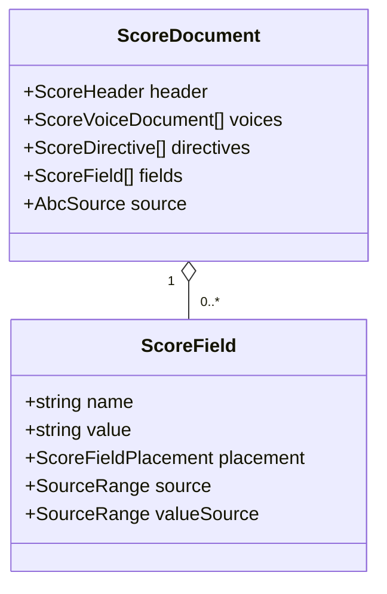
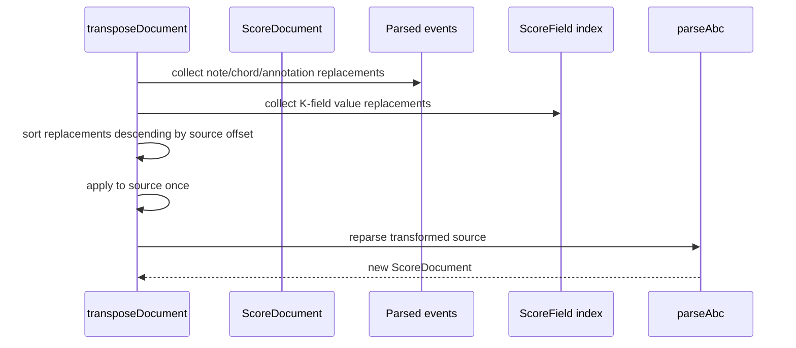

# ARCH-06 · Campos ABC estructurados y transposición sin búsqueda global

> Documento temporal. Se elimina solo tras implementación, regresión y auditoría final.

## 1. Diferencia entre arquitectura deseada y actual

### Arquitectura deseada

Las transformaciones musicales parten del documento canónico y de rangos de origen ya identificados por el parser. Una regex puede interpretar el contenido local de un lexema conocido, pero no debe volver a buscar estructura musical recorriendo `document.source.text`.

La transposición debe poder responder: “estos son los campos `K` reales del documento y estos son sus rangos”, sin escanear el fuente otra vez.

### Arquitectura actual

Notas, acordes y annotations se transforman correctamente a partir de eventos parseados y `SourceRange`. Sin embargo, `transposeDocument` termina llamando a `transposeKeys(source, semitones)`, que vuelve a buscar:

```ts
source
  .replace(/^K:([^\n]*)$/gm, ...)
  .replace(/\[K:([^\]]*)\]/g, ...)
```

Es una excepción arquitectónica relevante porque:

- el parser ya clasificó parte de esa sintaxis;
- la operación vuelve a inferir estructura desde texto global;
- un nuevo formato de campo obliga a editar la operación en vez del parser;
- campos de cuerpo no están representados explícitamente;
- la fuente de verdad queda dividida entre AST/source map y regex de operación.

## 2. Resultado objetivo

Se añade un índice source-preserving de campos ABC al `ScoreDocument`.



```ts
type ScoreFieldPlacement = "header" | "body" | "inline";

interface ScoreField {
  readonly name: string;
  readonly value: string;
  readonly placement: ScoreFieldPlacement;
  readonly source: SourceRange;
  readonly valueSource: SourceRange;
}
```

`source` cubre el campo completo. `valueSource` cubre únicamente el valor semántico sin los espacios exteriores. Esto permite transformar el valor preservando exactamente `K: `, corchetes y espacios circundantes.

## 3. Parsing

### 3.1 Cabecera

`headerMatches` deja de ser una estructura efímera sin equivalente canónico. Cada campo hasta e incluyendo el primer `K:` se proyecta como `ScoreField { placement: "header" }`.

El `ScoreHeader` sigue ofreciendo acceso semántico cómodo (`title`, `meter`, `key`, etc.). `fields` no lo sustituye: es el índice source-preserving para operaciones y futuras herramientas de diagnóstico.

### 3.2 Campos de cuerpo

Una línea de cuerpo formada por un campo ABC (`K:`, `Q:`, `M:`, etc.) se reconoce antes de tokenizar notas. Se registra como `placement: "body"` y no se convierte en un evento opaco.

Este cambio formaliza un comportamiento que la regex global de transposición ya intentaba cubrir de forma accidental para `K:`.

### 3.3 Campos inline

Cuando el lexer del cuerpo reconoce `[K:...]`, `[M:...]`, etc.:

1. conserva el `MusicalEvent(kind="inline_field")` para orden/source map por voz;
2. registra además un `ScoreField { placement: "inline" }` con el mismo rango y `valueSource`.

No hay doble semántica: el evento expresa posición dentro de la voz; `ScoreField` indexa campos transformables del documento.

## 4. Source ranges y formato

El parser debe calcular `valueSource` a partir del token que ya ha reconocido, no mediante una búsqueda global posterior.

Ejemplos:

```text
K: C mixolydian
   ^^^^^^^^^^^^ valueSource
^^^^^^^^^^^^^^^ source

[K:  G clef=bass ]
     ^^^^^^^^^^^ valueSource
^^^^^^^^^^^^^^^^^^ source
```

La operación reemplaza solo `valueSource`, de modo que el formato exterior permanece intacto.

## 5. Transposición

La transposición global sigue este orden conceptual:



Para cada `ScoreField` cuyo `name === "K"`:

- `none`/`perc` permanece inalterado;
- el valor se transpone con `transposeKeyValue`;
- se reemplaza únicamente `valueSource`;
- no se busca `K:` en `source.text`.

La transposición por voz **no** cambia campos globales, igual que ahora.

## 6. Casos que deben quedar protegidos

La nueva arquitectura debe demostrar explícitamente:

- `K:C` de cabecera se transpone;
- `K:G` como campo de cuerpo se transpone;
- `[K:D]` inline se transpone;
- `[K:none clef=perc]` permanece intacto;
- `"K:C"` en annotation no se trata como campo;
- `% K:C` en comentario no se trata como campo;
- `%%text K:C` no se trata como campo;
- texto opaco que contenga caracteres parecidos no se transforma;
- espacios exteriores del valor se conservan;
- transponer y aplicar la inversa restaura el fuente para el corpus soportado.

## 7. Plan de refactorización

1. Añadir `ScoreField`/`ScoreFieldPlacement` y `fields` al dominio.
2. Añadir helpers del parser que construyan campos con `source` y `valueSource` a partir del token ya reconocido.
3. Hacer que `bodyVoices` devuelva también campos de cuerpo/inline.
4. Poblar `ScoreDocument.fields` con cabecera + cuerpo/inline.
5. Añadir pruebas del parser para placements y rangos exactos.
6. Sustituir `transposeKeys` por replacements derivados de `document.fields`.
7. Añadir regresiones de comentarios/annotations/formato/campos de cuerpo.
8. Añadir test arquitectónico que prohíba el patrón de búsqueda global `replace(/^K:` y el helper `transposeKeys`.
9. Ejecutar codec + score-operations + property tests.
10. Ejecutar `npm run check`, workerd y Playwright completo.
11. Auditar que ningún consumidor ha empezado a depender de `fields` para política ajena al codec/operaciones.

## 8. Riesgos y decisiones

### Duplicación evento/campo inline

Es deliberada y cumple dos índices diferentes:

- el evento pertenece a la secuencia musical de una voz;
- el campo pertenece al índice de información ABC del documento.

Eliminar el evento rompería orden y source mapping; eliminar el índice obligaría a las operaciones a recorrer todas las voces para descubrir campos globales. Ambos son proyecciones del mismo token fuente.

### Reparse tras transformación

Se mantiene. Reemplazar valores mediante source ranges y volver a parsear sigue siendo una estrategia válida y segura para el corpus actual. ARCH-06 no intenta construir un editor incremental completo.

### Alcance

Se indexan campos ABC de forma genérica, pero solo `K` adquiere nueva política de transformación en este ARCH. No se inventan operaciones para `Q`, `M`, `L`, etc.

## 9. Auditoría final

ARCH-06 queda cerrado si:

- `ScoreDocument` conoce sus campos reales y rangos;
- la operación no busca campos mediante regex global sobre `source.text`;
- las regex restantes solo interpretan lexemas/valores locales ya clasificados;
- no se modifica comentario, annotation u opaque text por semejanza léxica;
- el formato exterior de campos se conserva;
- campos de cuerpo e inline están cubiertos;
- inversa/round-trip siguen pasando;
- CI integral queda verde.

Si `ScoreField` empieza a duplicar políticas musicales o a convertirse en un segundo AST, el diseño se considera fallido y se vuelve a §2. Su responsabilidad es source mapping de campos, no representar toda la semántica ABC.