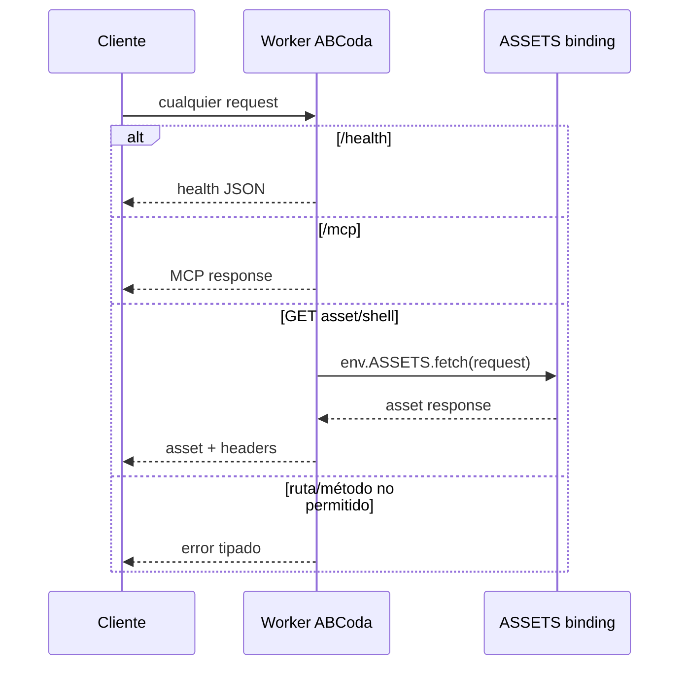

# M7 · Preview real y verificable de Worker/MCP Apps

> Documento temporal. Se elimina solo cuando exista una preview pública real validada contra el artefacto identificado. La preparación de repo por sí sola no cierra M7.

## 1. Estado de partida

ABCoda v2 ya tiene un Worker de preview separado en `apps/worker/wrangler.jsonc`:

- nombre `abcoda-v2-preview`;
- entrada `apps/worker/src/index.ts`;
- assets desde `dist/v2-widget`;
- `/mcp` y `/health` deben ejecutar el Worker antes que la capa de assets;
- allowlist para ChatGPT y desarrollo local;
- observabilidad de Cloudflare activada.

El CI actual construye y prueba ese Worker mediante `wrangler deploy --dry-run`, workerd y Playwright, pero una preview pública solo cuenta como validada después de ejecutar la sonda de esta fase.

## 2. Objetivo

M7 no busca simplemente “conseguir una URL”. Debe demostrar que una revisión concreta de `architecture-v2` produjo un artefacto identificable y que esa misma preview pública satisface las fronteras de Worker/MCP Apps.

Una validación produce este registro mínimo:

```json
{
  "gitSha": "...",
  "baseUrl": "https://...workers.dev",
  "checkedAt": "...",
  "appVersion": "...",
  "schemaVersion": 2,
  "rulesVersion": 4,
  "artifactHash": "...",
  "localArtifactHash": "...",
  "checks": {
    "health": "ok",
    "mcpInitialize": "ok",
    "toolsList": "ok",
    "validateWithoutUi": "ok",
    "renderTool": "ok",
    "widgetResource": "ok",
    "securityHeaders": "ok",
    "originPolicy": "ok"
  }
}
```

`artifactHash` remoto debe ser idéntico al SHA-256 de `dist/v2-widget/index.html` que se está validando.

## 3. Separar build, deploy y validación

### Build

El artefacto se crea y pasa CI antes del deploy. `verify-v2-artifacts.mjs` sigue siendo el gate local de tamaño/empaquetado/separación servidor-navegador.

### Deploy

El comando canónico v2 es explícito y no reutiliza `deploy:worker` legacy:

```text
npm run deploy:v2-preview
```

Ese script ejecuta Wrangler con `apps/worker/wrangler.jsonc` y presupone autenticación válida proporcionada por Cloudflare/CLI/CI. No contiene tokens ni account IDs.

La configuración conserva `abcoda-v2-preview` y `workers.dev`; no toca el Worker `abcoda` legacy ni producción.

### Validación

`npm run verify:v2-preview -- <baseUrl>` ejecuta una sonda de red contra la URL ya desplegada. No despliega ni modifica nada.

La sonda compara la preview con el artefacto local ya construido. Si `dist/v2-widget/index.html` no existe, falla en vez de reconstruirlo silenciosamente. Esto permite probar “el mismo artefacto” y no otro build parecido hecho cinco segundos después.

## 4. Sonda pública

La sonda debe verificar al menos:

### `/health`

- HTTP 200;
- JSON con `name = ABCoda`, `status = ok`, `runtime = cloudflare-worker`;
- `appVersion`, `schemaVersion`, `rulesVersion`, `artifactHash` presentes;
- `artifactHash` igual al SHA-256 local;
- `X-Request-Id` válido;
- `Cache-Control: no-store`;
- `X-Content-Type-Options: nosniff`;
- CSP defensiva de endpoint JSON.

### Política Origin/Host

Con `Origin: https://chatgpt.com`:

- respuesta permitida;
- `Access-Control-Allow-Origin` refleja el origen permitido;
- nunca usa `*`.

Con un origen deliberadamente no permitido:

- rechazo 403 con código estable;
- no refleja el origen atacante.

No se falsifica `Host` sobre Internet porque intermediarios pueden normalizarlo; esa condición ya queda cubierta en workerd.

### MCP

Usando POST JSON-RPC real sobre `/mcp`:

1. `initialize` responde con protocolo y servidor ABCoda;
2. `tools/list` expone `prepare_composition`, `validate_score`, `render_score`;
3. `validate_score` funciona como herramienta de datos sin depender de UI y devuelve `structuredContent` útil;
4. `render_score` devuelve su snapshot/presentación y referencia al recurso UI;
5. el `requestId` de resultado MCP coincide con el `X-Request-Id` HTTP de su llamada.

### Recurso widget

Leer el recurso `ui://abcoda/score-schema-2.html` mediante MCP y comprobar:

- MIME de MCP Apps correcto;
- HTML no vacío;
- `abcoda/artifactHash` igual al de `/health`;
- metadatos CSP presentes;
- el recurso no inserta el ABC de la sonda como HTML.

## 5. Audio/CSP

La preview real debe servir un recurso cuya CSP autorice la dependencia de samples que usa abcjs y no dominios adicionales arbitrarios.

La sonda automatizada puede comprobar los metadatos CSP del recurso. La comprobación de que un navegador/host real carga muestras sin bloqueo pertenece también a M8 de audición/host humano; M7 no simula audio WebAudio desde Node para aparentar más cobertura de la que tiene.

## 6. Privacidad

La sonda usa un marcador ABC reconocible para `validate_score`, pero ese marcador nunca se imprime en el informe persistido.

La ausencia de ABC/prompts en los logs propios está cubierta por ARCH-07 y sus regresiones. La validación operacional adicional en Cloudflare Logs requiere acceso al proyecto Cloudflare; M7 no añadirá endpoints de debug ni telemetría que devuelva logs al cliente.

## 7. Reproducibilidad del deploy

El despliegue debe poder repetirse desde el mismo checkout/artefacto sin cambiar código:

1. `npm run check` deja `dist/v2-widget/index.html` validado;
2. calcular y registrar su hash;
3. `npm run deploy:v2-preview` publica usando ese directorio, sin ejecutar `build:v2-widget` dentro del script;
4. `verify:v2-preview` exige el mismo hash remoto;
5. el informe registra `git rev-parse HEAD` y versiones remotas.

Una segunda ejecución de `deploy:v2-preview` desde el mismo árbol puede producir otro Worker version ID de Cloudflare, pero el `artifactHash` servido debe permanecer idéntico.

## 8. Mecanismo de autenticación

La vía utilizada para esta fase es GitHub Actions con `CLOUDFLARE_API_TOKEN` y `CLOUDFLARE_ACCOUNT_ID` almacenados como repository secrets. Los secretos no se guardan en Git, `.dev.vars`, documentación ni scripts.

El workflow `Deploy v2 preview` construye, valida, despliega y ejecuta la sonda pública. Durante la fase M7 puede recibir un trigger de push temporal y estrechamente acotado para permitir iteraciones desde esta sesión; al cerrar M7 debe volver a `workflow_dispatch` únicamente.

## 9. Implementación en repo

1. Mantener `deploy:v2-preview` sin build implícito.
2. Mantener `scripts/verify-v2-preview.mjs` como sonda pública reproducible.
3. Mantener el workflow de preview separado de CI y de producción.
4. Ejecutar CI integral.
5. Desplegar preview separada.
6. Ejecutar la sonda contra la URL pública.
7. Guardar evidencia del informe y Worker version/deployment ID cuando esté disponible.
8. Comprobar la preview dentro del host MCP Apps real o dejar esa parte explícitamente para M8 si requiere interacción humana.
9. Solo entonces eliminar este MD.

## 10. Iteración pública 1 · routing de assets

### Evidencia

El primer deployment autenticado se ejecutó desde el commit `78ca5583dcbe0709655deda91eaf89552062938e`.

Cloudflare desplegó correctamente:

- Worker: `abcoda-v2-preview`;
- URL: `https://abcoda-v2-preview.mud-repo-patcher-mcp-probe.workers.dev`;
- Worker Version ID: `dbd919dd-2cca-4df6-bce8-481e28cf6840`;
- artifact hash local previo al deploy: `9e6785eb96dd7da4350526b310c466b09cecbacea049a700cb2a8351d5d1320d`.

La autenticación y el upload fueron correctos. La sonda falló inmediatamente porque `GET /health` devolvió HTTP 404.

### Análisis

El Worker implementa `/health` y `/mcp` antes de delegar rutas GET desconocidas a `env.ASSETS.fetch()`. Por tanto, el propietario lógico del routing es el Worker.

La configuración desplegada utilizaba un `assets.run_worker_first` selectivo con `['/mcp', '/health']`. El despliegue real demuestra que esa configuración no materializó la frontera como esperábamos. No se concluye que los patrones exactos sean inválidos en general; se concluye que nuestra configuración selectiva no es una base suficientemente robusta para esta arquitectura.

Cloudflare documenta `run_worker_first: true` como la forma de invocar incondicionalmente el Worker antes de assets, permitiendo al propio Worker recuperar assets mediante el binding. Esa semántica coincide exactamente con la implementación actual.

### Revisión del diseño

El diseño no necesita una segunda capa de routing selectivo en Wrangler. La topología deseada queda simplificada a:



### Plan de corrección

1. fijar `assets.run_worker_first = true`;
2. añadir una regresión estructural que haga explícita esa decisión;
3. ejecutar CI normal;
4. redeploy mediante el workflow temporal de M7;
5. volver a ejecutar exactamente la misma sonda;
6. si el siguiente fallo aparece más adentro (`/mcp`, CSP, hash, etc.), clasificarlo y repetir el bucle desde diseño o implementación según corresponda.

## 11. Criterio de cierre

M7 queda cerrado cuando:

- existe una URL pública separada de producción;
- `/health`, `/mcp` y recurso widget pasan la sonda real;
- Origin/CORS real de ChatGPT funciona;
- el hash remoto coincide con el artefacto local probado;
- git SHA + versiones + artifactHash quedan registrados;
- no se han introducido secretos en repo;
- el mismo checkout puede redeployarse sin reconstruir el widget;
- el workflow de preview vuelve a ser manual después de la iteración;
- cualquier parte que requiera juicio humano está explícitamente trasladada a M8, no fingida mediante mocks.
