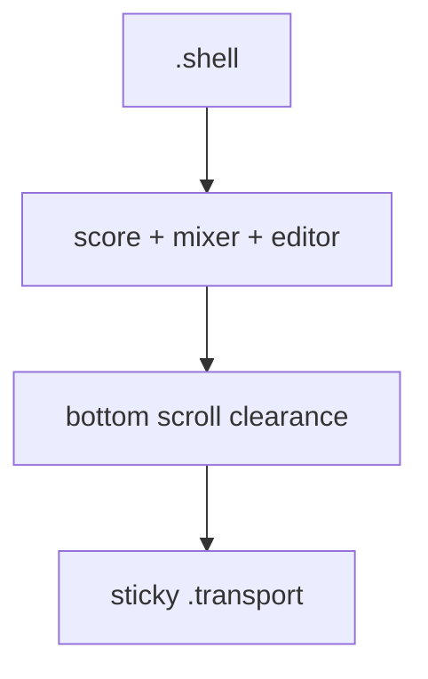

# M8 · Revisión humana final de UX, accesibilidad y audio

> Documento temporal. Se elimina solo cuando la revisión visual automatizada + inspección humana de artifacts esté cerrada y las comprobaciones que dependen de un host/audio real estén ejecutadas o claramente bloqueadas por M7.

## 1. Estado de partida

M1–M6 están cerrados. M7 tiene código, sonda pública y workflow manual de deploy, pero sigue abierto hasta disponer de una preview pública autenticada en Cloudflare.

La suite browser actual ya cubre responsive, navegación por teclado, cursor, reflow, transposición, rangos, forced-colors y genera artifacts visuales desktop/mobile en light/dark.

La inspección humana del artifact del run verde `746f15af` revela un defecto visible no expresado por los tests existentes:

- en viewport móvil el transporte sticky se divide en dos filas;
- el transporte queda pegado al borde inferior;
- el contenido de `mixer` puede desplazarse por debajo del dock;
- la captura muestra la última fila/controles parcialmente ocultos por el transporte;
- no hay overflow horizontal, por lo que el gate actual no lo detecta.

El CSS explica el defecto: `.transport { position: sticky; bottom: 0 }` y `.shell` solo reserva el padding normal/safe-area; no existe clearance vertical equivalente a la altura efectiva del dock.

## 2. Objetivo visual

Mantener el transporte sticky porque es una capacidad deseada, pero garantizar que cualquier contenido interactivo anterior pueda desplazarse completamente por encima de él.

No se pretende mantener siempre visibles simultáneamente todos los controles. El requisito es de **alcanzabilidad**: al hacer scroll hasta el final, el último control del mixer/editor debe poder quedar sin intersección con el rectángulo del transporte.

### Invariante geométrica

Para un viewport móvil con mixer abierto y scroll al final:

```text
lastInteractive.bottom <= transport.top - clearance
```

con `clearance >= 8 px`.

En desktop el comportamiento sticky y el layout actual deben permanecer sin cambios perceptibles.

## 3. Diseño

La solución preferida es reservar espacio de scroll en el contenedor, no volver `static` el dock ni añadir márgenes ad hoc a `mixer`.



El clearance se expresará como una custom property CSS de layout, con un valor móvil conservador que cubra el transporte de dos filas y safe-area inferior.

No se calculará la altura con JavaScript/ResizeObserver salvo que CSS resulte insuficiente; introducir estado DOM para un problema puramente de flujo sería peor arquitectura que el defecto original.

## 4. Regresión browser

Añadir un test específico y pequeño, separado de `widget-scenarios.e2e.ts`:

1. usar el proyecto móvil real de Playwright;
2. abrir `scenario=ranges` para disponer de tres filas y controles de transposición;
3. abrir mixer;
4. hacer scroll al final del documento;
5. medir el último elemento interactivo de la última fila y `.transport`;
6. exigir que no se solapen y exista un pequeño gap;
7. comprobar también que `scrollWidth <= innerWidth`.

El test debe saltarse o adaptarse en desktop; el defecto es específico del layout compacto.

## 5. Revisión visual posterior

Tras el fix:

- ejecutar CI completo;
- descargar `browser-visual-review-*` del run verde;
- inspeccionar al menos:
  - ready desktop light/dark;
  - ready mobile light/dark;
  - mixed mobile;
  - ranges mobile;
- confirmar manualmente que el clearance no crea una franja absurda en desktop;
- confirmar que la jerarquía de rangos naranja/rojo sigue clara.

Si el screenshot del viewport inicial sigue mostrando contenido detrás del dock, eso por sí mismo no es fallo: el criterio es que el contenido pueda desplazarse fuera de la oclusión. La captura diagnóstica se complementará, si hace falta, con una captura tras `scrollToEnd`.

## 6. Accesibilidad

La revisión final conserva los gates existentes:

- forced-colors distingue severidades sin depender solo de color;
- focus-visible sigue visible;
- controles conservan targets táctiles;
- zoom/reflow no introduce overflow;
- la reserva inferior incluye `--host-safe-bottom` y no lo sustituye.

## 7. Audio y host real

Hay dos comprobaciones que no se fingirán con mocks:

1. audición real de reproducción/cambio de instrumento/rangos;
2. ejecución dentro del host MCP Apps real contra una preview HTTPS.

La lógica de audio ya tiene regresiones de eventos, mute, tesitura y capacidad del SoundFont. M8 exige además percepción humana, pero esa parte depende de M7 para el host público.

Mientras M7 siga bloqueado por autenticación Cloudflare, M8 puede cerrar su subfase visual pero el documento permanece abierto con ese bloqueo explícito.

## 8. Plan de implementación

1. Añadir regresión geométrica móvil que falle con el estado actual.
2. Implementar clearance CSS sin JavaScript.
3. Ejecutar test focal y luego CI integral.
4. Descargar artifacts del nuevo run e inspeccionarlos visualmente.
5. Si hay nueva oclusión/layout raro, volver al diseño CSS y repetir.
6. Mantener las comprobaciones audio/host pendientes hasta que M7 produzca URL pública.
7. Eliminar este MD solo cuando las partes visual + host/audio humanas estén cerradas.

## 9. No hacer

- no hacer el transporte `static` en móvil solo para que el test pase;
- no medir su altura con JS si CSS puede resolverlo;
- no añadir padding enorme a todas las resoluciones;
- no confundir captura inicial con alcanzabilidad por scroll;
- no reducir targets táctiles;
- no ocultar controles para evitar la colisión;
- no declarar audio validado porque los eventos tengan volumen correcto en tests.

## 10. Criterio de cierre

M8 se cierra cuando:

- no existen controles móviles inalcanzables por solapamiento del dock;
- visual artifacts desktop/mobile/light/dark han sido inspeccionados tras el fix;
- forced-colors, responsive y no-overflow siguen verdes;
- preview/host real de M7 ha sido probado;
- reproducción e instrumentos han sido escuchados por una persona en navegador/host real;
- cualquier defecto encontrado se ha corregido y vuelto a pasar por el ciclo de pruebas/revisión.